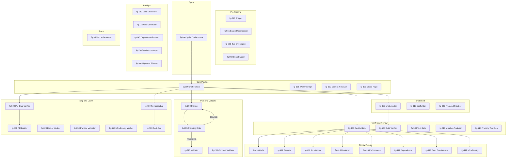

# Agent Dispatch Graph

42 agents organized by pipeline stage and tier.

```mermaid
graph TD
    subgraph "Pre-Pipeline"
        SHAPER["fg-010 Shaper"]
        SCOPE["fg-015 Scope Decomposer"]
        BUG["fg-020 Bug Investigator"]
        BOOTSTRAP["fg-050 Bootstrapper"]
    end
    
    subgraph "Sprint"
        SPRINT["fg-090 Sprint Orchestrator"]
    end
    
    subgraph "Core Pipeline"
        ORCH["fg-100 Orchestrator"]
        WORKTREE["fg-101 Worktree Mgr"]
        CONFLICT["fg-102 Conflict Resolver"]
        CROSSREPO["fg-103 Cross-Repo"]
    end
    
    subgraph "Preflight"
        DOCS_DISC["fg-130 Docs Discoverer"]
        WIKI["fg-135 Wiki Generator"]
        DEPREC["fg-140 Deprecation Refresh"]
        TEST_BOOT["fg-150 Test Bootstrapper"]
        MIGRATE_AGENT["fg-160 Migration Planner"]
    end
    
    subgraph "Plan and Validate"
        PLANNER["fg-200 Planner"]
        CRITIC["fg-205 Planning Critic"]
        VALIDATOR["fg-210 Validator"]
        CONTRACT["fg-250 Contract Validator"]
    end
    
    subgraph "Implement"
        IMPL["fg-300 Implementer"]
        SCAFFOLD["fg-310 Scaffolder"]
        FRONTEND["fg-320 Frontend Polisher"]
    end
    
    subgraph "Docs"
        DOCS_GEN["fg-350 Docs Generator"]
    end

    subgraph "Verify and Review"
        QUALITY["fg-400 Quality Gate"]
        BUILD["fg-505 Build Verifier"]
        TEST_GATE["fg-500 Test Gate"]
        MUTATION["fg-510 Mutation Analyzer"]
        PROPERTY["fg-515 Property Test Gen"]
    end
    
    subgraph "Review Agents"
        CODE_REV["fg-410 Code"]
        SEC_REV["fg-411 Security"]
        ARCH_REV["fg-412 Architecture"]
        FE_REV["fg-413 Frontend"]
        PERF_REV["fg-416 Performance"]
        DEP_REV["fg-417 Dependency"]
        DOC_REV["fg-418 Docs Consistency"]
        INFRA_REV["fg-419 Infra/Deploy"]
    end
    
    subgraph "Ship and Learn"
        PRESHIP["fg-590 Pre-Ship Verifier"]
        PR_BUILDER["fg-600 PR Builder"]
        DEPLOY["fg-620 Deploy Verifier"]
        PREVIEW["fg-650 Preview Validator"]
        INFRA_V["fg-610 Infra Deploy Verifier"]
        RETRO["fg-700 Retrospective"]
        POST["fg-710 Post-Run"]
    end
    
    ORCH --> PLANNER
    PLANNER --> CRITIC
    CRITIC --> |PROCEED| VALIDATOR
    CRITIC --> |REVISE| PLANNER
    ORCH --> IMPL --> BUILD
    ORCH --> QUALITY --> CODE_REV & SEC_REV & ARCH_REV & FE_REV & PERF_REV & DEP_REV & DOC_REV & INFRA_REV
    ORCH --> PRESHIP --> PR_BUILDER
    ORCH --> RETRO --> POST
    SPRINT --> ORCH
```
