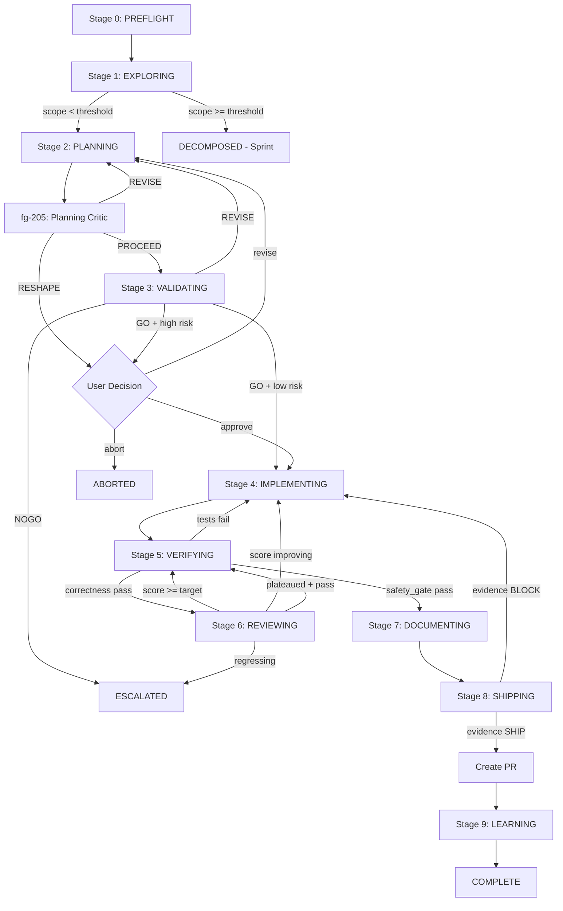

# Pipeline Flow

10-stage pipeline with decision points and feedback loops.

```mermaid
flowchart TD
    PREFLIGHT["Stage 0: PREFLIGHT"] --> EXPLORING["Stage 1: EXPLORING"]
    EXPLORING --> |"scope < threshold"| PLANNING["Stage 2: PLANNING"]
    EXPLORING --> |"scope >= threshold"| DECOMPOSED["DECOMPOSED - Sprint"]
    PLANNING --> CRITIC["fg-205: Planning Critic"]
    CRITIC --> |PROCEED| VALIDATING["Stage 3: VALIDATING"]
    CRITIC --> |REVISE| PLANNING
    CRITIC --> |RESHAPE| USER_GATE{"User Decision"}
    VALIDATING --> |"GO + low risk"| IMPLEMENTING["Stage 4: IMPLEMENTING"]
    VALIDATING --> |"GO + high risk"| USER_GATE
    VALIDATING --> |REVISE| PLANNING
    VALIDATING --> |NOGO| ESCALATED["ESCALATED"]
    USER_GATE --> |approve| IMPLEMENTING
    USER_GATE --> |revise| PLANNING
    USER_GATE --> |abort| ABORTED["ABORTED"]
    IMPLEMENTING --> VERIFYING["Stage 5: VERIFYING"]
    VERIFYING --> |"correctness pass"| REVIEWING["Stage 6: REVIEWING"]
    VERIFYING --> |"safety_gate pass"| DOCUMENTING["Stage 7: DOCUMENTING"]
    VERIFYING --> |"tests fail"| IMPLEMENTING
    REVIEWING --> |"score >= target"| VERIFYING
    REVIEWING --> |"score improving"| IMPLEMENTING
    REVIEWING --> |"plateaued + pass"| VERIFYING
    REVIEWING --> |regressing| ESCALATED
    DOCUMENTING --> SHIPPING["Stage 8: SHIPPING"]
    SHIPPING --> |"evidence SHIP"| PR["Create PR"]
    SHIPPING --> |"evidence BLOCK"| IMPLEMENTING
    PR --> LEARNING["Stage 9: LEARNING"]
    LEARNING --> COMPLETE["COMPLETE"]
```
