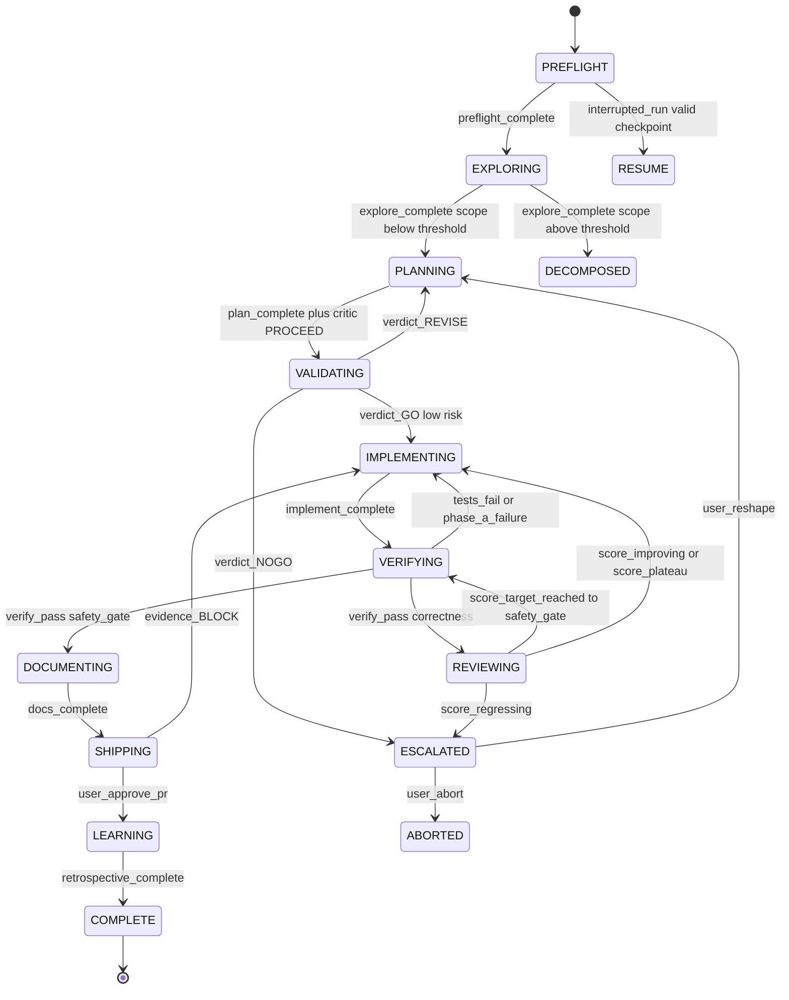

# State Machine

Pipeline state transitions (57 normal + 9 error rows).

```mermaid
stateDiagram-v2
    [*] --> PREFLIGHT
    PREFLIGHT --> EXPLORING : preflight_complete
    PREFLIGHT --> RESUME : interrupted_run valid checkpoint
    EXPLORING --> PLANNING : explore_complete scope below threshold
    EXPLORING --> DECOMPOSED : explore_complete scope above threshold
    PLANNING --> VALIDATING : plan_complete plus critic PROCEED
    VALIDATING --> IMPLEMENTING : verdict_GO low risk
    VALIDATING --> PLANNING : verdict_REVISE
    VALIDATING --> ESCALATED : verdict_NOGO
    IMPLEMENTING --> VERIFYING : implement_complete
    VERIFYING --> REVIEWING : verify_pass correctness
    VERIFYING --> DOCUMENTING : verify_pass safety_gate
    VERIFYING --> IMPLEMENTING : tests_fail or phase_a_failure
    REVIEWING --> VERIFYING : score_target_reached to safety_gate
    REVIEWING --> IMPLEMENTING : score_improving or score_plateau
    REVIEWING --> ESCALATED : score_regressing
    DOCUMENTING --> SHIPPING : docs_complete
    SHIPPING --> LEARNING : user_approve_pr
    SHIPPING --> IMPLEMENTING : evidence_BLOCK
    LEARNING --> COMPLETE : retrospective_complete
    COMPLETE --> [*]
    
    ESCALATED --> PLANNING : user_reshape
    ESCALATED --> ABORTED : user_abort
```
