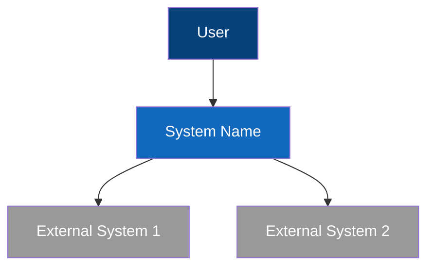
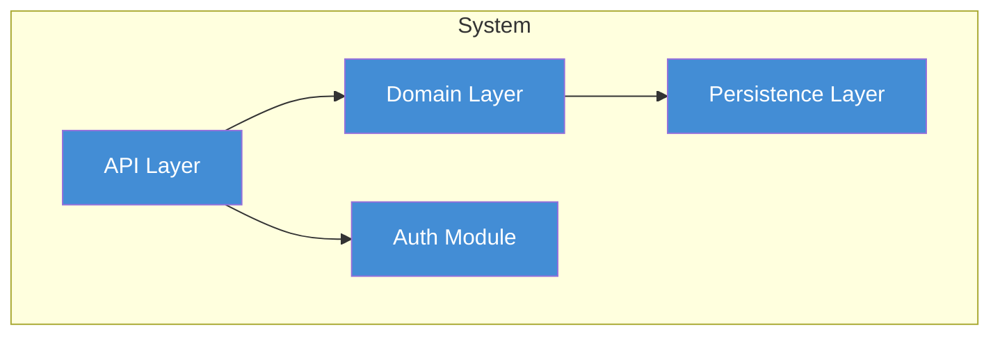
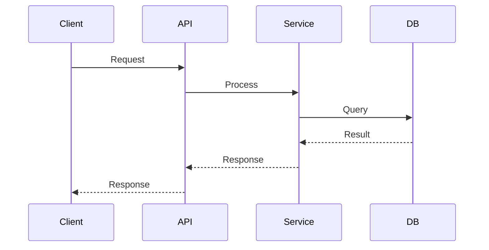
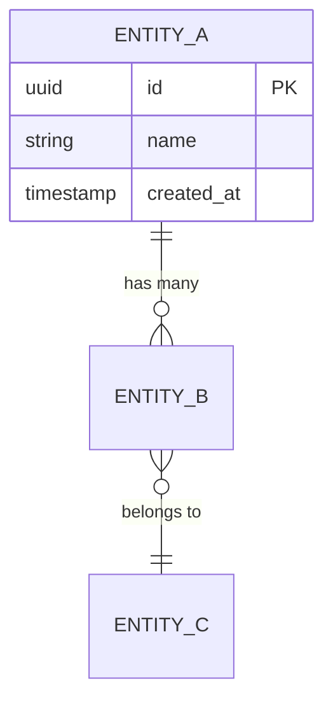
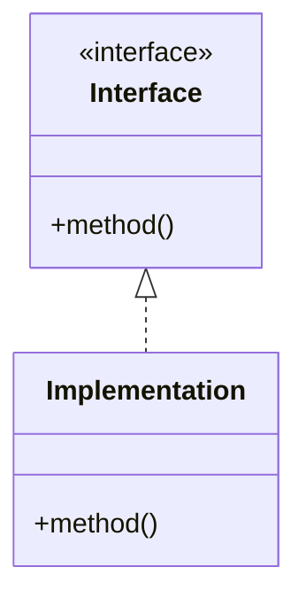

# Documentation Subsystem Implementation Plan

> **For agentic workers:** REQUIRED SUB-SKILL: Use superpowers:subagent-driven-development (recommended) or superpowers:executing-plans to implement this plan task-by-task. Steps use checkbox (`- [ ]`) syntax for tracking.

**Goal:** Add a full documentation subsystem to dev-pipeline — discovery agent, consistency reviewer, generator agent, standalone skill, module layer, graph integration, and all contract/test updates.

**Architecture:** Three new agents (`pl-130-docs-discoverer`, `docs-consistency-reviewer`, `pl-350-docs-generator`) integrated across pipeline stages. A `modules/documentation/` layer provides framework-aware templates. The knowledge graph gains `Doc*` node types. State schema bumps to v2.0.0 (clean break).

**Tech Stack:** Markdown agent definitions, YAML config, Bash scripts (graph), BATS tests

**Spec:** `docs/superpowers/specs/2026-03-30-documentation-subsystem-design.md`

---

## File Map

### New Files

| File | Purpose |
|------|---------|
| `agents/pl-130-docs-discoverer.md` | PREFLIGHT agent — discovers, parses, indexes docs |
| `agents/docs-consistency-reviewer.md` | REVIEW agent — validates code↔docs consistency |
| `agents/pl-350-docs-generator.md` | DOCUMENTING agent — generates/updates all doc types |
| `skills/docs-generate/SKILL.md` | On-demand documentation generation skill |
| `modules/documentation/conventions.md` | Generic documentation conventions |
| `modules/documentation/templates/readme.md` | README template |
| `modules/documentation/templates/architecture.md` | Architecture doc template |
| `modules/documentation/templates/adr.md` | ADR template (Nygard format) |
| `modules/documentation/templates/onboarding.md` | Onboarding guide template |
| `modules/documentation/templates/runbook.md` | Runbook template |
| `modules/documentation/templates/changelog.md` | Changelog template |
| `modules/documentation/templates/domain-model.md` | Domain/business doc template |
| `modules/documentation/templates/user-guide.md` | User guide template |
| `modules/documentation/diagram-patterns.md` | Mermaid/PlantUML patterns |
| `modules/frameworks/*/documentation/conventions.md` | Per-framework doc conventions (21 files) |
| `shared/learnings/documentation.md` | Documentation learnings file |
| `tests/structural/test-documentation-subsystem.bats` | Structural tests |
| `tests/contract/test-documentation-contracts.bats` | Contract tests |
| `tests/scenario/test-documentation-scenarios.bats` | Scenario tests |

### Modified Files

| File | Changes |
|------|---------|
| `shared/graph/schema.md` | Add 5 `Doc*` node types, 8 relationships |
| `shared/graph/query-patterns.md` | Add 5 Cypher queries (patterns 9-13) |
| `shared/graph/generate-seed.sh` | Add documentation layer discovery + Learnings node |
| `shared/stage-contract.md` | Stage 0 agent → `inline + pl-130-docs-discoverer`, Stage 7 agent → `pl-350-docs-generator`, 7th validation perspective |
| `shared/state-schema.md` | v2.0.0 clean break, add `documentation` field, add `docs-index.json` to directory listing |
| `shared/scoring.md` | Add `DOC-*` finding categories, `SCOUT-DOC-*` |
| `agents/pl-100-orchestrator.md` | PREFLIGHT steps 14-16, EXPLORE/PLAN/VALIDATE/REVIEW/DOCS stage changes, SHIP PR body |
| `agents/pl-210-validator.md` | 7th perspective: Documentation Consistency |
| `agents/pl-400-quality-gate.md` | Add `docs-consistency-reviewer` batch integration |
| `modules/frameworks/spring/local-template.md` | Add `documentation:` config section, add `docs-consistency-reviewer` to batch |
| (20 more local templates) | Same `documentation:` and batch additions |
| `tests/lib/module-lists.bash` | Add `MIN_DOCUMENTATION_BINDINGS`, `DISCOVERED_DOC_BINDINGS` |
| `CLAUDE.md` | Agent count 29→32, skill count 17→18, Stage 7 agent, state v2.0.0, graph schema, validation perspectives |
| `CONTRIBUTING.md` | Add "Adding documentation bindings" section |

---

## Task Dependency Graph

```
Task 1 (graph schema) ──► Task 2 (seed script) ──► Task 8 (integration)
Task 3 (module layer) ──► Task 5 (discoverer) ──► Task 8 (integration)
Task 3 (module layer) ──► Task 6 (reviewer) ──► Task 8 (integration)
Task 3 (module layer) ──► Task 7 (generator) ──► Task 8 (integration)
Task 4 (scoring/state) ──► Task 8 (integration)
Task 8 (integration) ──► Task 9 (skill)
Task 8 (integration) ──► Task 10 (local templates)
Task 10 (local templates) ──► Task 11 (CLAUDE.md + CONTRIBUTING)
Task 11 ──► Task 12 (tests)
```

Tasks 1, 3, 4 can run in parallel. Tasks 5, 6, 7 can run in parallel after 3. Task 12 is last.

---

### Task 1: Graph Schema Extension

**Files:**
- Modify: `shared/graph/schema.md`
- Modify: `shared/graph/query-patterns.md`

- [ ] **Step 1: Add Doc* node types to schema.md**

Open `shared/graph/schema.md`. After the `ProjectConfig` row in the "Project Codebase Nodes" table (line 41), add:

```markdown
| `DocFile` | `path`, `format`, `doc_type`, `last_modified`, `title`, `cross_repo` | A documentation file. `cross_repo` (boolean, default `false`) is `true` for docs discovered in related projects. |
| `DocSection` | `name`, `file_path`, `heading_level`, `start_line`, `end_line`, `content_hash`, `content_hash_updated` | A section within a doc file (parsed from heading hierarchy). `content_hash_updated` is an ISO8601 timestamp of when the hash was last computed. |
| `DocDecision` | `id`, `file_path`, `summary`, `status`, `confidence`, `extracted_at` | Architectural/design decision extracted from ADRs or inline markers. `extracted_at` is ISO8601 timestamp of extraction. |
| `DocConstraint` | `id`, `file_path`, `summary`, `scope`, `confidence` | Constraint/rule extracted from documentation |
| `DocDiagram` | `path`, `format`, `diagram_type`, `source_file` | Generated or discovered diagram |
```

After the table, add the enum definitions:

```markdown
**`doc_type` values:** `readme`, `adr`, `architecture`, `api-spec`, `runbook`, `onboarding`, `design-doc`, `migration-guide`, `changelog`, `contributing`, `user-guide`, `business-spec`, `other`

**`format` values:** `markdown`, `openapi-yaml`, `openapi-json`, `asciidoc`, `rst`, `plaintext`, `external-ref`

**`confidence` values:** `HIGH` (explicit markers like ADR format), `MEDIUM` (heuristic extraction), `LOW` (weak pattern matches)

**`DocDecision.status` values:** `proposed`, `accepted`, `deprecated`, `superseded`
```

- [ ] **Step 2: Add Doc* relationships to schema.md**

After the `USES_CONVENTION` row in the "Project Codebase Relationships" table (line 75), add:

```markdown
| `DESCRIBES` | `DocSection` → `ProjectFile`/`ProjectPackage`/`ProjectClass` | Documentation describes a code entity |
| `SECTION_OF` | `DocSection` → `DocFile` | Section belongs to a document |
| `DECIDES` | `DocDecision` → `ProjectFile`/`ProjectPackage` | Decision applies to code scope |
| `CONSTRAINS` | `DocConstraint` → `ProjectFile`/`ProjectPackage`/`ProjectClass` | Constraint restricts code entity evolution |
| `CONTRADICTS` | `DocSection`/`DocDecision`/`DocConstraint` → `ProjectFile`/`ProjectClass` | Detected inconsistency (created by consistency reviewer) |
| `DIAGRAMS` | `DocDiagram` → `DocFile`/`ProjectPackage` | Diagram visualizes a doc or code structure |
| `SUPERSEDES` | `DocDecision` → `DocDecision` | Later decision replaces an earlier one |
| `DOC_IMPORTS` | `DocFile` → `DocFile` | Doc references another doc (cross-links) |
```

- [ ] **Step 3: Add 5 Cypher query patterns to query-patterns.md**

Append after pattern 8 (Plugin Contract Impact) in `shared/graph/query-patterns.md`:

```markdown
---

### 9. Documentation Impact

**Used during:** PLAN

Determines which documentation sections describe files that are about to change. The orchestrator runs this before dispatching `pl-200-planner` to surface documented decisions and constraints for affected code.

```cypher
MATCH (changed:ProjectFile {path: $filePath})
MATCH (ds:DocSection)-[:DESCRIBES]->(changed)
MATCH (ds)-[:SECTION_OF]->(df:DocFile)
OPTIONAL MATCH (dd:DocDecision)-[:DECIDES]->(changed)
OPTIONAL MATCH (dc:DocConstraint)-[:CONSTRAINS]->(changed)
RETURN df.path, ds.name, dd.summary, dc.summary
```

**Parameters:**
- `$filePath` — Repo-relative path of the file being changed (e.g., `"src/domain/User.kt"`).

---

### 10. Stale Docs Detection

**Used during:** REVIEW

Identifies documentation sections that describe files modified more recently than the doc's last hash computation. The orchestrator runs this before dispatching the `docs-consistency-reviewer`.

```cypher
MATCH (ds:DocSection)-[:DESCRIBES]->(pf:ProjectFile)
WHERE pf.last_modified > ds.content_hash_updated
RETURN ds.name, ds.file_path, pf.path AS stale_for_file
```

**Parameters:**
- None. Returns all stale documentation sections project-wide.

---

### 11. Decision Traceability

**Used during:** VALIDATE

Returns all non-superseded decisions and constraints that apply to a given package or class. The orchestrator uses this to inject documented decisions into the validator's context for the Documentation Consistency perspective.

```cypher
MATCH (dd:DocDecision)-[:DECIDES]->(target)
WHERE target.path STARTS WITH $packagePath OR target.name = $className
OPTIONAL MATCH (dd)<-[:SUPERSEDES]-(newer:DocDecision)
WHERE newer IS NULL
RETURN dd.id, dd.summary, dd.status, dd.confidence, target.path
```

**Parameters:**
- `$packagePath` — Repo-relative package path prefix (e.g., `"src/domain/order/"`).
- `$className` — Simple class name (e.g., `"OrderService"`). One of the two parameters is required.

---

### 12. Contradiction Report

**Used during:** REVIEW

Returns all active contradiction relationships between documentation and code. Used by the quality gate to inject prior contradictions into the reviewer context to prevent re-reporting.

```cypher
MATCH (source)-[:CONTRADICTS]->(target)
RETURN labels(source)[0] AS source_type, COALESCE(source.summary, source.name) AS source_desc,
       target.path AS code_target, source.file_path AS doc_source
```

**Parameters:**
- None. Returns all active contradictions.

---

### 13. Documentation Coverage Gap

**Used during:** DOCUMENTING

Finds project packages that have no documentation section describing them. The orchestrator uses this to determine which new docs the generator should create.

```cypher
MATCH (pp:ProjectPackage)
WHERE NOT (pp)<-[:DESCRIBES]-(:DocSection)
RETURN pp.name, pp.path ORDER BY pp.path
```

**Parameters:**
- None. Returns all undocumented packages.
```

- [ ] **Step 4: Verify changes are consistent**

Run: `grep -c "DocFile\|DocSection\|DocDecision\|DocConstraint\|DocDiagram" shared/graph/schema.md`
Expected: At least 10 matches (5 node definitions + 5+ relationship references)

Run: `grep -c "^### [0-9]" shared/graph/query-patterns.md`
Expected: 13 (8 original + 5 new)

- [ ] **Step 5: Commit**

```bash
git add shared/graph/schema.md shared/graph/query-patterns.md
git commit -m "feat: add Doc* node types and documentation Cypher queries to graph schema"
```

---

### Task 2: Graph Seed Script Update

**Files:**
- Modify: `shared/graph/generate-seed.sh`

- [ ] **Step 1: Read the current seed script**

Read `shared/graph/generate-seed.sh` to find the exact insertion point. Look for the section that creates `LayerModule` nodes (the LAYERS array loop).

- [ ] **Step 2: Add `documentation` to the LAYERS array**

Find the `LAYERS=( ... )` array in `generate-seed.sh` and add `"documentation"`:

```bash
LAYERS=(databases persistence migrations api-protocols messaging caching search storage auth observability build-systems ci-cd container-orchestration documentation)
```

This causes the existing layer loop to automatically:
- Create `LayerModule` nodes for files in `modules/documentation/`
- Create `FrameworkBinding` nodes for `modules/frameworks/*/documentation/`
- Create `HAS_BINDING` and `EXTENDS` relationships

- [ ] **Step 3: Add CREATE INDEX for Doc* nodes**

Find the index creation block (near line 56) and add after the existing indexes:

```bash
emit "CREATE INDEX IF NOT EXISTS FOR (df:DocFile) ON (df.path);"
emit "CREATE INDEX IF NOT EXISTS FOR (ds:DocSection) ON (ds.file_path);"
emit "CREATE INDEX IF NOT EXISTS FOR (dd:DocDecision) ON (dd.id);"
emit "CREATE INDEX IF NOT EXISTS FOR (dc:DocConstraint) ON (dc.id);"
emit "CREATE INDEX IF NOT EXISTS FOR (dg:DocDiagram) ON (dg.path);"
```

- [ ] **Step 4: Add Learnings node for documentation**

Find the section that creates Learnings nodes and edges (near line 288). The existing loop already handles `modules/{layer}/*.md` files, so `shared/learnings/documentation.md` will be auto-discovered IF it exists. Verify the loop covers the `documentation` layer by checking the loop iterates over `LAYERS`. If it already does, no change needed here.

- [ ] **Step 5: Verify the changes**

Run: `grep -c "documentation" shared/graph/generate-seed.sh`
Expected: At least 2 matches (LAYERS array + one more)

Run: `grep "DocFile\|DocSection\|DocDecision\|DocConstraint\|DocDiagram" shared/graph/generate-seed.sh`
Expected: 5 index creation lines

- [ ] **Step 6: Commit**

```bash
git add shared/graph/generate-seed.sh
git commit -m "feat: extend graph seed script with documentation layer and Doc* indexes"
```

---

### Task 3: Documentation Module Layer

**Files:**
- Create: `modules/documentation/conventions.md`
- Create: `modules/documentation/templates/readme.md`
- Create: `modules/documentation/templates/architecture.md`
- Create: `modules/documentation/templates/adr.md`
- Create: `modules/documentation/templates/onboarding.md`
- Create: `modules/documentation/templates/runbook.md`
- Create: `modules/documentation/templates/changelog.md`
- Create: `modules/documentation/templates/domain-model.md`
- Create: `modules/documentation/templates/user-guide.md`
- Create: `modules/documentation/diagram-patterns.md`
- Create: `shared/learnings/documentation.md`
- Create: `modules/frameworks/*/documentation/conventions.md` (21 files)

- [ ] **Step 1: Create generic documentation conventions**

Create `modules/documentation/conventions.md`:

```markdown
# Documentation Conventions

Generic documentation conventions for all frameworks. Framework-specific bindings override where they conflict.

## Principles

- **Tone:** Technical, precise, no filler. Write for the developer who will maintain this code in 6 months.
- **Structure:** Lead with "what and why", then "how". Every document starts with a one-paragraph summary.
- **Code references:** Use backtick-wrapped identifiers with relative paths. Never reference line numbers (they shift).
- **Diagrams:** Mermaid preferred (renders natively in GitHub). One diagram per concept — do not overload.
- **Staleness prevention:** Every auto-generated section includes `<!-- generated by dev-pipeline docs-generator -->`. Never generate content inside `<!-- user-maintained -->` / `<!-- /user-maintained -->` fences.

## Document Types

| Type | Purpose | When to generate |
|------|---------|-----------------|
| README | Project overview, setup, usage | Every project |
| Architecture doc | System overview, layers, data flow | Projects with 3+ packages |
| ADR | Architectural decision record | Significant choices (2+ alternatives evaluated) |
| API documentation | OpenAPI spec, endpoint docs | Projects with HTTP endpoints |
| Onboarding guide | Dev setup, codebase tour | Projects with 5+ contributors or complex setup |
| Runbook | Deploy, rollback, monitoring | Projects with production deployments |
| Changelog | Structured change history | Every project with releases |
| Domain model doc | Entity catalog, glossary, business rules | Projects with 5+ domain entities |
| User guide | Feature docs, how-to guides | User-facing products |
| Migration guide | Breaking changes, upgrade steps | Major version changes |

## ADR Format (Michael Nygard)

```markdown
# ADR-NNN: Title

## Status

Accepted | Deprecated | Superseded by ADR-NNN

## Context

What is the issue that we're seeing that is motivating this decision or change?

## Decision

What is the change that we're proposing and/or doing?

## Consequences

What becomes easier or more difficult to do because of this change?
```

## Changelog Format (Keep a Changelog)

```markdown
## [Unreleased]

### Added
- New feature description

### Changed
- Existing feature modification

### Fixed
- Bug fix description

### Removed
- Removed feature description
```

## Dos

- Start every document with a one-paragraph summary
- Use relative links between docs (`[Architecture](./architecture.md)`)
- Include "Last updated" date in generated docs
- Use Mermaid for diagrams (C4, sequence, ER)
- Mark auto-generated sections clearly

## Don'ts

- Don't reference line numbers — they change with every commit
- Don't duplicate content across docs — link instead
- Don't generate content inside user-maintained fences
- Don't include implementation details that change frequently
- Don't create empty placeholder docs — every doc must have content
```

- [ ] **Step 2: Create document templates**

Create `modules/documentation/templates/readme.md`:

```markdown
# {project_name}

{one_paragraph_summary}

## Getting Started

### Prerequisites

{prerequisites_list}

### Installation

{installation_steps}

### Running

{run_commands}

## Architecture

{architecture_summary — link to architecture.md if it exists}

## API

{api_summary — link to API docs if they exist}

## Testing

{test_commands}

## Contributing

{contributing_summary — link to CONTRIBUTING.md if it exists}

<!-- generated by dev-pipeline docs-generator -->
```

Create `modules/documentation/templates/architecture.md`:

```markdown
# Architecture

{one_paragraph_summary}

## System Overview

{system_context_diagram — Mermaid C4 context}

## Components

{component_diagram — Mermaid C4 component}

### {component_name}

- **Purpose:** {what_it_does}
- **Location:** `{package_path}`
- **Dependencies:** {list}

## Data Flow

{sequence_diagram — Mermaid sequence for primary flow}

## Design Decisions

{link_to_ADRs — or inline summary if no ADRs exist}

## Constraints

{documented_constraints_list}

<!-- generated by dev-pipeline docs-generator -->
```

Create `modules/documentation/templates/adr.md`:

```markdown
# ADR-{number}: {title}

## Status

{proposed | accepted | deprecated | superseded by ADR-NNN}

## Context

{what_motivates_this_decision}

## Decision

{what_we_decided}

## Consequences

### Positive
{what_becomes_easier}

### Negative
{what_becomes_harder}

### Neutral
{side_effects_that_are_neither}

<!-- generated by dev-pipeline docs-generator -->
```

Create `modules/documentation/templates/onboarding.md`:

```markdown
# Developer Onboarding

{one_paragraph_summary}

## Prerequisites

{tools_and_versions}

## Setup

{step_by_step_setup}

## Codebase Tour

### Where Things Live

| Directory | Purpose |
|-----------|---------|
| {path} | {description} |

### Key Concepts

{domain_concepts_and_terminology}

### Common Tasks

| Task | Command |
|------|---------|
| {task} | `{command}` |

<!-- generated by dev-pipeline docs-generator -->
```

Create `modules/documentation/templates/runbook.md`:

```markdown
# Runbook: {service_name}

## Deployment

### Deploy to Production

{deploy_steps}

### Rollback

{rollback_steps}

## Monitoring

### Health Checks

| Endpoint | Expected | Alert threshold |
|----------|----------|----------------|
| {path} | {response} | {threshold} |

### Key Metrics

{metrics_to_watch}

## Common Issues

### {issue_title}

- **Symptoms:** {what_you_see}
- **Cause:** {why_it_happens}
- **Fix:** {how_to_resolve}

<!-- generated by dev-pipeline docs-generator -->
```

Create `modules/documentation/templates/changelog.md`:

```markdown
# Changelog

All notable changes to this project will be documented in this file.

The format is based on [Keep a Changelog](https://keepachangelog.com/).

## [Unreleased]

### Added

### Changed

### Fixed

### Removed

<!-- generated by dev-pipeline docs-generator -->
```

Create `modules/documentation/templates/domain-model.md`:

```markdown
# Domain Model

{one_paragraph_summary}

## Entity Diagram

{er_diagram — Mermaid ER}

## Entities

### {entity_name}

- **Purpose:** {what_it_represents}
- **Location:** `{file_path}`
- **Key fields:** {field_list}
- **Invariants:** {business_rules}

## Glossary

| Term | Definition |
|------|-----------|
| {term} | {definition} |

## Business Rules

| Rule | Applies to | Enforced by |
|------|-----------|-------------|
| {rule} | {entity} | {code_location} |

<!-- generated by dev-pipeline docs-generator -->
```

Create `modules/documentation/templates/user-guide.md`:

```markdown
# User Guide: {feature_name}

{one_paragraph_summary}

## Overview

{what_this_feature_does}

## How to Use

### {use_case_title}

{step_by_step_instructions}

## FAQ

### {question}

{answer}

<!-- generated by dev-pipeline docs-generator -->
```

- [ ] **Step 3: Create diagram patterns**

Create `modules/documentation/diagram-patterns.md`:

```markdown
# Diagram Patterns

Mermaid patterns for auto-generated documentation diagrams. The generator uses these as templates.

## C4 Context Diagram



## C4 Component Diagram



## Sequence Diagram



## Entity Relationship Diagram



## Class Hierarchy


```

- [ ] **Step 4: Create documentation learnings file**

Create `shared/learnings/documentation.md`:

```markdown
# Cross-Project Learnings: documentation

## PREEMPT items

(No learnings yet — will be populated by retrospective agent)
```

- [ ] **Step 5: Create framework documentation bindings (21 files)**

For each framework directory in `modules/frameworks/*/`, create `documentation/conventions.md`. The content adapts to each framework's doc style. Create them all in one step. Here are representative examples — the remaining 18 follow the same pattern with framework-appropriate content:

Create `modules/frameworks/spring/documentation/conventions.md`:

```markdown
# Spring Documentation Conventions

> Extends `modules/documentation/conventions.md` with Spring-specific patterns.

## Code Documentation

- Use KDoc for Kotlin, Javadoc for Java on all public interfaces
- Document `@Transactional` boundaries in use case KDoc
- Document custom annotations with usage examples

## API Documentation

- OpenAPI spec via springdoc-openapi annotations
- Every endpoint: summary, description, request/response examples
- Error responses documented with `@ApiResponse` annotations

## Architecture Documentation

- Document hexagonal layer boundaries: core, ports, adapters
- Document which adapters implement which ports
- Domain model diagrams use ER format for JPA entities

## Persistence Documentation

- Document entity relationships and cascade behavior
- Document custom queries with purpose and performance notes
- Document migration files with WHY comments in SQL
```

Create `modules/frameworks/react/documentation/conventions.md`:

```markdown
# React Documentation Conventions

> Extends `modules/documentation/conventions.md` with React-specific patterns.

## Component Documentation

- Document component props with TypeScript interfaces (TSDoc on the interface)
- Document component purpose and usage examples
- Document state management patterns (TanStack Query, Zustand, etc.)

## API Documentation

- Document API hooks with input/output types and error handling
- Document data fetching patterns and cache invalidation

## Architecture Documentation

- Component tree diagrams using Mermaid class diagrams
- Document routing structure
- Document shared state and data flow between components
```

Create `modules/frameworks/fastapi/documentation/conventions.md`:

```markdown
# FastAPI Documentation Conventions

> Extends `modules/documentation/conventions.md` with FastAPI-specific patterns.

## API Documentation

- FastAPI auto-generates OpenAPI — verify docstrings are present on all endpoints
- Use Pydantic model Field descriptions for schema documentation
- Document dependency injection chains

## Code Documentation

- Use Google-style docstrings on all public functions
- Document async patterns and background task usage

## Architecture Documentation

- Document router organization and middleware chain
- Document database session lifecycle and transaction patterns
```

Create similar files for the remaining 18 frameworks. Each must have at minimum a header line, the "Extends" reference, and framework-appropriate sections. For frameworks where documentation is minimal (e.g., `embedded`, `k8s`), keep the file short but present:

Frameworks to create: `axum`, `swiftui`, `vapor`, `express`, `sveltekit`, `k8s`, `embedded`, `go-stdlib`, `aspnet`, `django`, `nextjs`, `gin`, `jetpack-compose`, `kotlin-multiplatform`, `angular`, `nestjs`, `vue`, `svelte`.

Pattern for each:
```markdown
# {Framework} Documentation Conventions

> Extends `modules/documentation/conventions.md` with {Framework}-specific patterns.

## Code Documentation

{framework-appropriate code doc rules}

## Architecture Documentation

{framework-appropriate architecture doc rules}
```

- [ ] **Step 6: Verify all files exist**

Run: `ls modules/documentation/conventions.md modules/documentation/diagram-patterns.md modules/documentation/templates/*.md | wc -l`
Expected: 10 (conventions + diagram-patterns + 8 templates)

Run: `for fw in modules/frameworks/*/; do [ -f "${fw}documentation/conventions.md" ] || echo "MISSING: ${fw}documentation/conventions.md"; done`
Expected: No output (all 21 exist)

Run: `[ -f shared/learnings/documentation.md ] && echo "OK" || echo "MISSING"`
Expected: OK

- [ ] **Step 7: Commit**

```bash
git add modules/documentation/ modules/frameworks/*/documentation/ shared/learnings/documentation.md
git commit -m "feat: add documentation module layer with conventions, templates, and 21 framework bindings"
```

---

### Task 4: State Schema and Scoring Updates

**Files:**
- Modify: `shared/state-schema.md`
- Modify: `shared/scoring.md`

- [ ] **Step 1: Update state schema version to v2.0.0**

Read `shared/state-schema.md`. Change the version in the example JSON from `"1.1.0"` to `"2.0.0"`. Update the Field Reference entry for `version` to document the v2.0.0 clean break:

Replace the `version` field description that mentions v1.1.0 compatibility with:

```markdown
| `version` | string | Yes | Schema version string (`"2.0.0"`). Version 2.0.0 is a clean break from v1.1.0 — adds `documentation` field as a required top-level object. Old state files from v1.x are incompatible — use `/pipeline-reset` to clear them. |
```

- [ ] **Step 2: Add documentation field to state.json schema**

After the `spec` field at the end of the JSON example, add the `documentation` object. In the example JSON, add before the closing `}`:

```json
  "documentation": {
    "last_discovery_timestamp": "",
    "files_discovered": 0,
    "sections_parsed": 0,
    "decisions_extracted": 0,
    "constraints_extracted": 0,
    "code_linkages": 0,
    "coverage_gaps": [],
    "stale_sections": 0,
    "external_refs": [],
    "generation_history": []
  }
```

Add to the Field Reference table:

```markdown
| `documentation` | object | Yes | Documentation subsystem state. Populated by `pl-130-docs-discoverer` at PREFLIGHT and updated by `pl-350-docs-generator` at DOCUMENTING. |
| `documentation.last_discovery_timestamp` | string | Yes | ISO8601 timestamp of last documentation discovery run. Empty string if never run. |
| `documentation.files_discovered` | number | Yes | Count of documentation files found in the project. |
| `documentation.sections_parsed` | number | Yes | Count of document sections parsed (heading-level granularity). |
| `documentation.decisions_extracted` | number | Yes | Count of `DocDecision` entities extracted from ADRs and design docs. |
| `documentation.constraints_extracted` | number | Yes | Count of `DocConstraint` entities extracted from architecture and design docs. |
| `documentation.code_linkages` | number | Yes | Count of `DESCRIBES`/`DECIDES`/`CONSTRAINS` relationships created between docs and code. |
| `documentation.coverage_gaps` | array | Yes | Repo-relative package paths with no documentation coverage. |
| `documentation.stale_sections` | number | Yes | Count of doc sections describing files modified after the doc's last update. |
| `documentation.external_refs` | array | Yes | External documentation URLs discovered in project markdown. |
| `documentation.generation_history` | array | Yes | Array of generation run records. Each entry: `run_id`, `timestamp`, `files_created`, `files_updated`, `diagrams_generated`, `coverage_before`, `coverage_after`. |
```

- [ ] **Step 3: Add docs-index.json to directory structure**

In the "Directory Structure" section of `shared/state-schema.md`, add to the file tree:

```
+-- docs-index.json                        # Documentation index (fallback when Neo4j unavailable)
```

Add to the File Lifecycle table:

```markdown
| `docs-index.json` | Stage 0 (PREFLIGHT) | `pl-130-docs-discoverer` | Yes (enables graph-free operation) | No |
```

- [ ] **Step 4: Add DOC-* finding categories to scoring.md**

Read `shared/scoring.md`. Find the section listing finding categories/prefixes. Add:

```markdown
### DOC-* Findings (Documentation Consistency)

Reported by `docs-consistency-reviewer` during REVIEW stage.

| Category | Severity | Deduction | Description |
|----------|----------|-----------|-------------|
| `DOC-DECISION-*` | CRITICAL (HIGH confidence) / WARNING (MEDIUM) | -20 / -5 | Code violates a documented architectural decision |
| `DOC-CONSTRAINT-*` | CRITICAL (HIGH confidence) / WARNING (MEDIUM) | -20 / -5 | Code violates a documented constraint |
| `DOC-STALE-*` | WARNING | -5 | Documentation section describes changed files but is no longer accurate |
| `DOC-MISSING-*` | INFO | -2 | New public API or module has no documentation coverage |
| `DOC-DIAGRAM-*` | INFO | -2 | Diagram covers changed packages and may need update |
| `DOC-CROSSREF-*` | WARNING | -5 | Two documentation sections describe the same entity with contradictory content |

**LOW confidence handling:** Decisions and constraints with `confidence: LOW` appear as `SCOUT-DOC-*` findings (no score deduction). They are informational only until confidence is upgraded to MEDIUM or HIGH.
```

- [ ] **Step 5: Verify changes**

Run: `grep -c "2.0.0" shared/state-schema.md`
Expected: At least 2 (version field value + description)

Run: `grep -c "DOC-" shared/scoring.md`
Expected: At least 6

- [ ] **Step 6: Commit**

```bash
git add shared/state-schema.md shared/scoring.md
git commit -m "feat: state schema v2.0.0 with documentation field, DOC-* scoring categories"
```

---

### Task 5: pl-130-docs-discoverer Agent

**Files:**
- Create: `agents/pl-130-docs-discoverer.md`

- [ ] **Step 1: Create the agent file**

Create `agents/pl-130-docs-discoverer.md` with the full agent definition. Follow the existing pattern from `pl-150-test-bootstrapper.md` (PREFLIGHT agent with description examples):

```markdown
---
name: pl-130-docs-discoverer
description: |
  Discovers, classifies, parses, and indexes project documentation into the knowledge graph (or fallback JSON index). Runs at PREFLIGHT after convention stack resolution. Scans for markdown, OpenAPI specs, ADRs, architecture docs, runbooks, changelogs, diagrams, and external references. Extracts decisions and constraints at section level with confidence scoring.

  <example>
  Context: A Spring Boot project with docs/architecture.md, 3 ADRs, and an OpenAPI spec
  user: "Run documentation discovery for this project"
  assistant: "Discovered 12 doc files, parsed 67 sections, extracted 3 decisions (HIGH confidence) and 8 constraints (MEDIUM confidence), created 34 code linkages. 4 packages have no documentation coverage."
  <commentary>The discoverer found structured docs, extracted semantic content, and linked it to code. Coverage gaps are reported for downstream agents.</commentary>
  </example>

  <example>
  Context: A new project with only README.md and no other docs
  user: "Discover documentation"
  assistant: "Discovered 1 doc file (README.md), parsed 5 sections, 0 decisions, 0 constraints, 2 code linkages. 11 packages have no documentation coverage."
  <commentary>Minimal docs are still indexed. Coverage gaps inform the generator at Stage 7.</commentary>
  </example>

  <example>
  Context: Incremental run — 2 docs changed since last discovery
  user: "Re-discover documentation"
  assistant: "Incremental discovery: 2 files changed, 1 new file. Re-parsed 12 sections, 1 new decision extracted. Updated 3 linkages."
  <commentary>Convention drift detection via content_hash comparison enables efficient incremental re-discovery.</commentary>
  </example>
model: inherit
color: cyan
tools: ['Read', 'Glob', 'Grep', 'Bash']
---

# Pipeline Documentation Discoverer (pl-130)

You discover, classify, parse, and index all documentation in the consuming project. You run at PREFLIGHT after convention stacks are resolved.

**Philosophy:** Apply principles from `shared/agent-philosophy.md` — challenge assumptions, consider alternatives, seek disconfirming evidence.

Discover documentation for: **$ARGUMENTS**

---

## 1. Identity & Purpose

You scan the project for all documentation files, parse them into sections, extract architectural decisions and constraints, and link them to code entities. Your output feeds all downstream agents — explorers, planners, validators, reviewers, and the documentation generator.

You do NOT generate documentation. You only discover and index what exists.

---

## 2. Input

You receive from the orchestrator:
1. **Project root path**
2. **Documentation config** — from `dev-pipeline.local.md` `documentation:` section (discovery limits, exclude patterns)
3. **Graph availability** — whether Neo4j is running (`state.json.integrations.neo4j.available`)
4. **Previous discovery timestamp** — from `state.json.documentation.last_discovery_timestamp` (empty on first run)
5. **Related projects** — from `dev-pipeline.local.md` `related_projects:` (for cross-repo shallow scan)

---

## 3. Discovery Scope

### Default Exclusions (always applied)

`node_modules/`, `.pipeline/`, `build/`, `dist/`, `.git/`, `vendor/`, `target/`, `.gradle/`, `__pycache__/`

### Configurable Limits

From `documentation.discovery:` in config:
- `max_files` (default: 500) — skip with WARNING if exceeded
- `max_file_size_kb` (default: 512) — skip individual files larger than this
- `exclude_patterns` — additional glob exclusions

### Discovery Targets

| Category | Detection Method |
|----------|-----------------|
| Markdown | Glob `**/*.md` minus exclusions |
| ADRs | Path patterns: `adr/`, `docs/adr/`, `docs/decisions/`, filenames `NNN-*.md` or `ADR-*.md` |
| OpenAPI | `openapi.{yaml,json}`, `swagger.{yaml,json}` recursive |
| Architecture | Files/dirs: `architecture`, `design`, `technical` |
| Runbooks | Files/dirs: `runbook`, `playbook`, `operations` |
| Changelogs | `CHANGELOG.md`, `CHANGES.md`, `HISTORY.md` |
| User/business docs | `docs/`, `documentation/`, `wiki/`, `guides/` |
| Diagrams | `*.mermaid`, `*.puml`, `*.plantuml`, `*.drawio`, embedded mermaid/plantuml in markdown |
| External refs | URLs in markdown pointing to Confluence, Notion, wiki |
| RST/AsciiDoc | `*.rst`, `*.adoc` |

### Cross-Repo Shallow Scan

For each related project in config: scan root for `README.md` and `docs/` only. Create `DocFile` nodes with `cross_repo: true`. Do not parse sections or extract semantics from cross-repo docs.

---

## 4. Processing Pipeline

### Step 1: Scan

Collect all doc file paths matching targets above. Record metadata: path, size, last_modified, format.

If file count exceeds `max_files`: log WARNING with count, write what was found so far, and stop. Do not silently truncate.

### Step 2: Classify

Assign `doc_type` to each file:
- Path-based: `adr/` → `adr`, `runbook` → `runbook`, `CHANGELOG` → `changelog`, etc.
- Content-based: files starting with `# ADR` or containing `## Status: Accepted` → `adr`
- Fallback: files in `docs/` → `other`, standalone markdown → `readme` if named README, else `other`

### Step 3: Parse Sections

Split markdown files by heading hierarchy (H1 → H2 → H3). Each heading becomes a `DocSection` with:
- `name`: heading text
- `heading_level`: 1, 2, or 3
- `start_line`, `end_line`: line range of section body
- `content_hash`: SHA256 of section body text
- `content_hash_updated`: current ISO8601 timestamp

OpenAPI specs: create one section per path group (`/api/users/*`, `/api/orders/*`).

### Step 4: Extract Semantics

Scan for decision and constraint markers:

**DocDecision extraction:**
- ADR files with explicit "## Decision" section → `HIGH` confidence, status from "## Status" section
- Design docs with "we chose X over Y" / "decided to" / "selected X because" → `MEDIUM` confidence, status `accepted`
- Weak pattern matches ("prefer X", "tend to use X") → `LOW` confidence, status `accepted`

**DocConstraint extraction:**
- Architecture docs with imperative constraints ("must", "never", "always", "shall not" + technical term) → `MEDIUM` confidence
- ADR consequences that state restrictions → `MEDIUM` confidence
- Weak pattern matches → `LOW` confidence

**Status values:** `proposed`, `accepted`, `deprecated`, `superseded`. Default: `accepted` if not explicitly stated.

### Step 5: Link to Code

For each `DocSection`, `DocDecision`, `DocConstraint`:
1. Extract referenced file paths (relative links, inline code paths) → grep for existence
2. Extract class/function names (backtick-wrapped identifiers) → grep in source files
3. Extract package references (directory paths) → match against project structure
4. Create `DESCRIBES`, `DECIDES`, `CONSTRAINS` relationships for confirmed matches

Unmatched references are logged as warnings in the discovery summary.

### Step 6: Detect Cross-References

Parse markdown links (`[text](path)`) between doc files → create `DOC_IMPORTS` relationships.

### Step 7: Detect Diagrams

Scan for:
- Standalone files: `*.mermaid`, `*.puml`, `*.plantuml`, `*.drawio`
- Embedded blocks: fenced code blocks with `mermaid` or `plantuml` language tag
- Create `DocDiagram` nodes with `diagram_type` (c4, sequence, er, class, flowchart, other)

---

## 5. Output Mode

### Graph Mode (Neo4j available)

Execute Cypher statements to create/merge all `Doc*` nodes and relationships. Use `MERGE` for idempotency on re-runs. Use `CREATE` only for new nodes not yet in the graph.

### Index Mode (Neo4j unavailable)

Write `.pipeline/docs-index.json` with the same data:

```json
{
  "timestamp": "2026-03-30T10:00:00Z",
  "files": [{"path": "...", "doc_type": "...", "format": "...", "title": "...", "cross_repo": false}],
  "sections": [{"name": "...", "file_path": "...", "heading_level": 2, "content_hash": "...", "start_line": 10, "end_line": 25}],
  "decisions": [{"id": "ADR-001", "file_path": "...", "summary": "...", "status": "accepted", "confidence": "HIGH"}],
  "constraints": [{"id": "CONST-001", "file_path": "...", "summary": "...", "scope": "src/domain/", "confidence": "MEDIUM"}],
  "linkages": [{"source_type": "section", "source_id": "...", "target_path": "..."}],
  "diagrams": [{"path": "...", "format": "mermaid", "diagram_type": "c4", "source_file": "..."}],
  "cross_references": [{"from": "...", "to": "..."}]
}
```

### Convention Drift Detection (incremental runs)

If `previous_discovery_timestamp` is set:
1. Compare `content_hash` per `DocSection` against stored values
2. Changed sections → re-extract decisions/constraints, update linkages
3. Deleted files → remove corresponding nodes (graph) or entries (index)
4. New files → full processing

### Stage Notes

Write `stage_0_docs_discovery.md`:

```
## Documentation Discovery Summary

Files discovered: {N}
Sections parsed: {N}
Decisions extracted: {N} (HIGH: {n}, MEDIUM: {n}, LOW: {n})
Constraints extracted: {N} (HIGH: {n}, MEDIUM: {n}, LOW: {n})
Code linkages: {N}
Coverage gaps: {list of undocumented packages}
Stale sections: {N}
External refs: {N}
Cross-repo docs: {N}
Unmatched references: {list}
Mode: {graph | index}
```

---

## 6. Forbidden Actions

- Do NOT generate or modify any documentation files
- Do NOT write to the user's working tree (only `.pipeline/` files)
- Do NOT make HTTP requests to validate external URLs
- Do NOT read file contents beyond what's needed for classification and section parsing (respect `max_file_size_kb`)
```

- [ ] **Step 2: Verify frontmatter compliance**

Run: `head -1 agents/pl-130-docs-discoverer.md`
Expected: `---`

Run: `grep "^name:" agents/pl-130-docs-discoverer.md`
Expected: `name: pl-130-docs-discoverer`

Run: `grep -c "Forbidden Actions" agents/pl-130-docs-discoverer.md`
Expected: 1

- [ ] **Step 3: Commit**

```bash
git add agents/pl-130-docs-discoverer.md
git commit -m "feat: add pl-130-docs-discoverer agent for PREFLIGHT documentation discovery"
```

---

### Task 6: docs-consistency-reviewer Agent

**Files:**
- Create: `agents/docs-consistency-reviewer.md`

- [ ] **Step 1: Create the reviewer agent file**

Create `agents/docs-consistency-reviewer.md` following the existing reviewer pattern (see `security-reviewer.md`):

```markdown
---
name: docs-consistency-reviewer
description: |
  Reviews code changes for consistency with documented architectural decisions, constraints, and existing documentation. Reports DOC-* findings when code contradicts, invalidates, or leaves stale any project documentation. Supports graph-based and file-based analysis modes.

  <example>
  Context: Developer changed OrderController to make a synchronous HTTP call, but ADR-003 states "all inter-service communication via async messaging"
  user: "Review code for documentation consistency"
  assistant: "DOC-DECISION-001 [CRITICAL] Decision violation: ADR-003 states 'all inter-service communication via async messaging' but OrderController.kt:45 makes synchronous HTTP call to InventoryService"
  <commentary>HIGH confidence ADR decision violated — reported as CRITICAL. Creates CONTRADICTS relationship in graph.</commentary>
  </example>

  <example>
  Context: API endpoint path changed from /api/orders to /api/v2/orders, but README still references the old path
  user: "Check docs consistency after endpoint change"
  assistant: "DOC-STALE-001 [WARNING] Stale docs: README.md section 'API Endpoints' references POST /api/orders but implementation changed to POST /api/v2/orders in OrderRoutes.kt:23"
  <commentary>Documentation references outdated code — WARNING severity to flag for update.</commentary>
  </example>
tools:
  - Read
  - Glob
  - Grep
  - Bash
  - mcp__plugin_context7_context7__resolve-library-id
  - mcp__plugin_context7_context7__query-docs
---

# Documentation Consistency Reviewer

You review code changes for consistency with the project's existing documentation. You report findings when code contradicts documented decisions, violates documented constraints, or leaves documentation stale.

**Philosophy:** Apply principles from `shared/agent-philosophy.md` — challenge assumptions, consider alternatives, seek disconfirming evidence.

Review the changed files for documentation consistency: **$ARGUMENTS**

---

## 1. Identity & Purpose

You are a specialized reviewer that checks whether code changes are consistent with the project's documented architecture, decisions, and constraints. You do NOT review code quality, security, or performance — those are handled by other reviewers. You ONLY check code against documentation.

---

## 2. Input

You receive from the quality gate (`pl-400`):
1. **Changed files list** — files modified in this pipeline run
2. **Graph context** — pre-queried documentation nodes:
   - `DocDecision` and `DocConstraint` nodes linked to changed files (from "Documentation Impact" query)
   - Stale doc sections (from "Stale Docs Detection" query)
   - Active contradictions (from "Contradiction Report" query — for dedup)
3. **Previous batch findings** — top 20 from earlier batches (for cross-reviewer dedup)
4. **Discovery summary** — from `stage_0_docs_discovery.md` or `.pipeline/docs-index.json`

---

## 3. Review Dimensions

### 3.1 Decision Compliance

Check whether code changes violate any `DocDecision`:
- Read the decision summary and the code change
- Determine if the code contradicts the decision
- Severity: CRITICAL if decision confidence is HIGH, WARNING if MEDIUM
- LOW confidence decisions → report as `SCOUT-DOC-DECISION-*` (no score deduction)

### 3.2 Constraint Violations

Check whether changes break any `DocConstraint`:
- Read the constraint and the code change
- Determine if the code violates the constraint
- Same severity mapping as decisions (HIGH → CRITICAL, MEDIUM → WARNING, LOW → SCOUT)

### 3.3 Stale Documentation

For each changed file with a `DESCRIBES` relationship to a `DocSection`:
- Read the doc section content
- Read the code change (git diff)
- Determine if the doc section is still accurate
- If inaccurate: WARNING

### 3.4 Missing Documentation

For new public APIs, modules, or packages with no `DESCRIBES` relationship:
- Report as INFO
- Only report for genuinely public interfaces (exported, annotated as API, etc.)

### 3.5 Diagram Drift

If `DocDiagram` nodes cover changed packages:
- Report as INFO — diagrams may need update
- Do not verify diagram content accuracy (too error-prone)

### 3.6 Cross-Doc Inconsistency

If two `DocSection` nodes describe the same code entity:
- Compare their content for contradictions
- Report as WARNING if contradictory

---

## 4. Finding Format

```
file:line | DOC-{CATEGORY}-{NNN} | {SEVERITY} | {description} | {fix_hint}
```

Categories: `DOC-DECISION`, `DOC-CONSTRAINT`, `DOC-STALE`, `DOC-MISSING`, `DOC-DIAGRAM`, `DOC-CROSSREF`

Severities: `CRITICAL`, `WARNING`, `INFO`

Scout prefix: `SCOUT-DOC-{CATEGORY}` for LOW confidence (no score deduction)

Examples:
```
OrderController.kt:45 | DOC-DECISION-001 | CRITICAL | ADR-003 states "all inter-service communication via async messaging" but this line makes synchronous HTTP call to InventoryService | Update code to use async messaging, or create ADR superseding ADR-003
README.md:23 | DOC-STALE-001 | WARNING | Section "API Endpoints" references POST /api/orders but endpoint changed to POST /api/v2/orders in OrderRoutes.kt:23 | Update README.md section to reflect new endpoint path
PaymentGateway.kt:1 | DOC-MISSING-001 | INFO | New public interface has no documentation coverage | Add KDoc/TSDoc and consider adding to architecture docs
```

---

## 5. CONTRADICTS Relationship

For confirmed contradictions (CRITICAL or WARNING severity):
- If graph is available: create a `CONTRADICTS` relationship between the doc entity and the code entity
- This prevents re-reporting the same contradiction on subsequent runs
- The relationship persists until the doc or code is fixed

Before reporting a finding, check the "Contradiction Report" pre-query results. If the same contradiction already exists as an active `CONTRADICTS` relationship, skip it (already reported).

---

## 6. Graceful Degradation

### No Neo4j

Fall back to file-based analysis:
1. Read `.pipeline/docs-index.json` for discovered docs, decisions, constraints
2. Grep changed file paths in all discovered doc files
3. Check for obvious staleness (file references in docs that don't match changed code)
4. Cannot create `CONTRADICTS` relationships — log finding only

### No Docs in Project

Return zero findings with an INFO note:
```
(none) | DOC-MISSING-000 | INFO | No project documentation discovered. Run /docs-generate to bootstrap documentation. | /docs-generate --all
```

---

## 7. Forbidden Actions

- Do NOT review code quality, security, or performance — only documentation consistency
- Do NOT modify any files
- Do NOT create documentation — only report findings
- Do NOT report findings for LOW confidence decisions/constraints as scored findings (use SCOUT prefix)
- Do NOT report cross-repo doc inconsistencies as CRITICAL (always WARNING)
```

- [ ] **Step 2: Verify frontmatter compliance**

Run: `head -1 agents/docs-consistency-reviewer.md`
Expected: `---`

Run: `grep "^name:" agents/docs-consistency-reviewer.md`
Expected: `name: docs-consistency-reviewer`

- [ ] **Step 3: Commit**

```bash
git add agents/docs-consistency-reviewer.md
git commit -m "feat: add docs-consistency-reviewer agent for REVIEW stage DOC-* findings"
```

---

### Task 7: pl-350-docs-generator Agent

**Files:**
- Create: `agents/pl-350-docs-generator.md`

- [ ] **Step 1: Create the generator agent file**

Create `agents/pl-350-docs-generator.md`:

```markdown
---
name: pl-350-docs-generator
description: |
  Generates and updates project documentation. Replaces the inline orchestrator logic at Stage 7 (DOCUMENTING). Supports pipeline mode (diff-driven, scoped to current run) and standalone mode (full project scope via /docs-generate skill). Generates README, architecture docs, ADRs, OpenAPI specs, onboarding guides, runbooks, changelogs, domain model docs, user guides, migration guides, and Mermaid diagrams.

  <example>
  Context: Pipeline run changed 8 files in the order management domain, adding a new API endpoint
  user: "Generate documentation for order management changes"
  assistant: "Updated docs/api-spec.yaml (1 new endpoint), updated CHANGELOG.md (Added section), generated docs/adr/ADR-004-order-event-sourcing.md (from plan Challenge Brief). Coverage: 78% (+5%)."
  <commentary>Pipeline mode: diff-driven, only updates affected docs and generates ADR for significant decision from the plan.</commentary>
  </example>

  <example>
  Context: Legacy project with no docs, user runs /docs-generate --all
  user: "Generate full documentation suite"
  assistant: "Generated 7 documents: README.md, docs/architecture.md (with C4 diagram), docs/onboarding.md, docs/domain-model.md (12 entities), docs/changelog.md, 3 Mermaid diagrams. Coverage: 0% → 72%."
  <commentary>Standalone mode: coverage-driven, bootstraps full documentation suite from code analysis.</commentary>
  </example>
model: inherit
color: green
tools: ['Read', 'Glob', 'Grep', 'Bash', 'Write', 'Edit', 'Agent', 'Skill', 'mcp__plugin_context7_context7__resolve-library-id', 'mcp__plugin_context7_context7__query-docs']
---

# Pipeline Documentation Generator (pl-350)

You generate and update project documentation. In pipeline mode, you replace the inline orchestrator logic at Stage 7 (DOCUMENTING). In standalone mode, you bootstrap full documentation suites.

**Philosophy:** Apply principles from `shared/agent-philosophy.md` — challenge assumptions, consider alternatives, seek disconfirming evidence.

Generate documentation for: **$ARGUMENTS**

---

## 1. Identity & Purpose

You generate accurate, useful documentation from code analysis and graph data. You adapt to the project's framework via documentation conventions from `modules/documentation/` and framework-specific bindings. You never fabricate information — every statement in generated docs must be traceable to code, config, or graph data.

---

## 2. Input

### Pipeline Mode (dispatched by orchestrator at Stage 7)

1. **Changed files list** — files modified in this run
2. **Quality verdict** — PASS/CONCERNS with score
3. **Plan stage notes** — for ADR generation (Challenge Brief content)
4. **Doc discovery summary** — from `stage_0_docs_discovery.md`
5. **Documentation config** — from `dev-pipeline.local.md` `documentation:` section
6. **Framework conventions** — path to `modules/documentation/conventions.md` + framework binding

### Standalone Mode (dispatched by `/docs-generate` skill)

1. **Generation request** — type(s) to generate, or `--all`, or `--coverage`
2. **Project root path**
3. **Framework detection** — from `dev-pipeline.local.md` or auto-detected from stack markers
4. **Documentation config** — if `dev-pipeline.local.md` exists; defaults otherwise

---

## 3. Generation Capabilities

| Type | `doc_type` | Sources |
|------|-----------|---------|
| README | `readme` | Code structure, manifests, existing README (merge) |
| Architecture doc | `architecture` | Graph/index nodes, imports, framework conventions |
| ADRs | `adr` | Plan stage notes (Challenge Brief), validator findings |
| API documentation | `api-spec` | Controller/route annotations, DTOs, existing spec (merge) |
| Onboarding guide | `onboarding` | Graph structure, build/test commands, conventions |
| Runbooks | `runbook` | CI/CD config, Docker, infra docs, health checks |
| Migration guides | `migration-guide` | Migration files, version diffs, deprecation findings |
| Changelogs | `changelog` | Git diff, plan stage notes |
| Business/domain docs | `business-spec` | Domain entities, use cases, acceptance criteria |
| Diagrams | (embedded) | Graph relationships, class hierarchy, API flows |
| User guides | `user-guide` | Acceptance criteria, UI components, API endpoints |

---

## 4. Pipeline Mode Guardrails

### Always (unconditional)

- Update existing docs affected by changed files (guided by graph `DESCRIBES` relationships or `docs-index.json` linkages)
- Verify KDoc/TSDoc on all new public interfaces
- Update changelog with this run's changes
- Update OpenAPI spec if API endpoints changed

### Conditional (only when `auto_generate.<type>` is `true` in config)

- Generate ADRs for decisions meeting significance criteria (2+ of: alternatives evaluated, cross-cutting impact, irreversibility, security/compliance, precedent-setting)
- Generate missing docs for new modules/packages
- Generate diagrams for new architecture components

### Never in Pipeline Mode

- Full documentation suite bootstrap
- Runbook or user guide creation (standalone-only)

---

## 5. Worktree Awareness

**Pipeline mode:** Write all files to `.pipeline/worktree` (the active worktree). Documentation changes are included in the PR alongside code changes.

**Standalone mode:** Write directly to the user's working tree. No worktree exists.

---

## 6. Generation Strategy

### Step 1: Assess Coverage

Read graph `DocFile` nodes or `.pipeline/docs-index.json`. Map existing documentation to code packages.

### Step 2: Determine Need

- Pipeline mode: identify docs affected by changed files (graph-guided) + check guardrails
- Standalone mode: identify coverage gaps based on user's requested types

### Step 3: Plan Documents

Build a doc plan: list of files to create/update, sections per file, estimated size.

### Step 4: Generate

For each document:
1. Read relevant source code (use graph/index to find related files)
2. Read framework doc conventions (`modules/documentation/conventions.md` + binding if available)
3. Read template from `modules/documentation/templates/{doc_type}.md`
4. Generate content, filling template placeholders with real data from code
5. For updates: merge with existing content. Preserve `<!-- user-maintained -->` fences.
6. Add staleness marker: `<!-- generated by dev-pipeline docs-generator -->`

### Step 5: Generate Diagrams

Create Mermaid diagrams embedded in markdown:
- C4 for architecture overview
- Sequence for API flows and inter-service communication
- ER for domain entity relationships
- Class for type hierarchies

If `mmdc` (mermaid-cli) is available: validate syntax with `mmdc --validate`. If not: skip validation, log INFO.

Use patterns from `modules/documentation/diagram-patterns.md`.

### Step 6: Update Graph/Index

Create/update `DocFile`, `DocSection`, `DocDiagram` nodes and relationships for generated docs. In index mode, update `.pipeline/docs-index.json`.

### Step 7: Export (if configured)

If `documentation.export.<target>.enabled` is `true` and a matching MCP server is available:
- Push generated docs to the external system
- If MCP unavailable: write locally, log WARNING

---

## 7. User-Maintained Section Protection

Content inside `<!-- user-maintained -->` / `<!-- /user-maintained -->` fences is NEVER modified. When updating a file:
1. Parse the existing file to identify user-maintained regions
2. Generate new content for all other regions
3. Reconstruct the file preserving user-maintained regions in their exact positions

---

## 8. Output

### Pipeline Mode

- Generated/updated doc files in `.pipeline/worktree/docs/` (or configured `output_dir`)
- `stage_7_notes_{storyId}.md`:
  ```
  ## Documentation Generation Summary

  Files created: {list}
  Files updated: {list}
  ADRs generated: {count}
  Diagrams generated: {count}
  KDoc/TSDoc verified: {count} interfaces, {count} missing
  Coverage: {before}% → {after}% ({delta})
  Export: {target: status}
  ```
- Updated graph/index

### Standalone Mode

- Generated/updated doc files in project's `docs/` (or configured path)
- Coverage report printed to console

---

## 9. Forbidden Actions

- Do NOT fabricate information — every statement must be traceable to code
- Do NOT modify source code files — only documentation files
- Do NOT modify content inside user-maintained fences
- Do NOT generate empty placeholder docs (every doc must have real content)
- Do NOT create runbooks or user guides in pipeline mode
- Do NOT delete existing documentation files
```

- [ ] **Step 2: Verify frontmatter compliance**

Run: `head -1 agents/pl-350-docs-generator.md`
Expected: `---`

Run: `grep "^name:" agents/pl-350-docs-generator.md`
Expected: `name: pl-350-docs-generator`

Run: `grep -c "Forbidden Actions" agents/pl-350-docs-generator.md`
Expected: 1

- [ ] **Step 3: Commit**

```bash
git add agents/pl-350-docs-generator.md
git commit -m "feat: add pl-350-docs-generator agent for Stage 7 documentation generation"
```

---

### Task 8: Pipeline Integration (Orchestrator, Stage Contract, Validator, Quality Gate)

**Files:**
- Modify: `shared/stage-contract.md`
- Modify: `agents/pl-100-orchestrator.md`
- Modify: `agents/pl-210-validator.md`
- Modify: `agents/pl-400-quality-gate.md`

- [ ] **Step 1: Update stage contract overview table**

Read `shared/stage-contract.md`. In the Stage Overview table, update two rows:

Change Stage 0:
```markdown
| 0 | PREFLIGHT | inline + `pl-130-docs-discoverer` | `PREFLIGHT` | User invokes `/pipeline-run` with a requirement | Config loaded, convention stacks resolved per component, rule caches generated, state initialized, documentation discovered |
```

Change Stage 7:
```markdown
| 7 | DOCS | `pl-350-docs-generator` | `DOCUMENTING` | Review passed | Documentation updated; no new public interfaces lack documentation; coverage gaps reduced or explained |
```

- [ ] **Step 2: Update Stage 0 detail section in stage contract**

In the Stage 0 detail section, after step 13, add:

```markdown
14. If `documentation.enabled` is `true` (default): dispatch `pl-130-docs-discoverer` with project root, documentation config, graph availability, previous discovery timestamp, and related projects. Write discovery summary to `stage_0_docs_discovery.md`. Store metrics in `state.json.documentation`.
```

Update the exit condition:
```markdown
**Exit condition:** Config loaded, convention stacks resolved per component, rule caches generated, state initialized, documentation discovered (if enabled).
```

- [ ] **Step 3: Update Stage 7 detail section in stage contract**

Replace the current Stage 7 detail section. Find the line `### Stage 7: DOCS` and replace the entire section (through the next `---`) with:

```markdown
### Stage 7: DOCS

**Agent:** `pl-350-docs-generator`
**story_state:** `DOCUMENTING`

**Entry condition:** Review passed (Stage 6) with PASS or CONCERNS verdict.

**Inputs:**
- Changed files list (from implementation checkpoints)
- Quality verdict and score (from Stage 6)
- Plan stage notes (for ADR generation — Challenge Brief content)
- Doc discovery summary (`stage_0_docs_discovery.md`)
- `documentation:` config from `dev-pipeline.local.md`
- Framework conventions path

**Actions:**
1. Dispatch `pl-350-docs-generator` in pipeline mode with inputs above.
2. Generator updates affected docs, generates ADRs for significant decisions, updates changelog, verifies KDoc/TSDoc.
3. Generator writes results to `.pipeline/worktree` alongside implementation changes.

**Outputs:**
- Generated/updated documentation files in worktree
- `stage_7_notes_{storyId}.md` — generation summary, coverage metrics
- Updated graph/index

**Exit condition:** Documentation updated. No new public interfaces lack documentation. Coverage gaps reduced or explained in stage notes.
```

- [ ] **Step 4: Add Documentation Consistency to validator perspectives**

Read `agents/pl-210-validator.md`. Find the validation perspectives list (Section 3). After "Approach Quality" (perspective 6), add perspective 7:

```markdown
### Perspective 7: Documentation Consistency

**Question:** Do planned changes conflict with documented architectural decisions or constraints?

**Inputs:** `DocDecision` and `DocConstraint` summaries for affected packages (from orchestrator's "Decision Traceability" graph pre-query, or from `.pipeline/docs-index.json`)

**Check:**
1. For each task in the plan, identify the packages/files it modifies
2. Check if any `DocDecision` (HIGH confidence) applies to those packages
3. If the plan contradicts a decision without explicitly superseding it → REVISE finding
4. Check if any `DocConstraint` (HIGH or MEDIUM confidence) would be violated → REVISE finding

**If no documentation context available** (no docs discovered, no graph/index): skip this perspective with INFO log.

**Verdicts:**
- Plan contradicts HIGH-confidence decision without superseding → REVISE
- Plan violates MEDIUM+ constraint → REVISE with specific constraint cited
- No conflicts found → PASS
```

Also update the description frontmatter to mention 7 perspectives instead of 6:

Change: `Validates implementation plans across 6 perspectives`
To: `Validates implementation plans across 7 perspectives`

And update the perspectives list in the config reference:

Change: `perspectives: [architecture, security, edge_cases, test_strategy, conventions, approach_quality]`
To: `perspectives: [architecture, security, edge_cases, test_strategy, conventions, approach_quality, documentation_consistency]`

- [ ] **Step 5: Update orchestrator PREFLIGHT section**

Read `agents/pl-100-orchestrator.md`. Find the PREFLIGHT section (Stage 0). After step 13 (component path mapping), add:

```markdown
14. If `documentation.enabled` is `true` (default): dispatch `pl-130-docs-discoverer` with:
    - Project root path
    - Documentation config from `dev-pipeline.local.md` `documentation:` section
    - Graph availability from `state.json.integrations.neo4j.available`
    - Previous discovery timestamp from `state.json.documentation.last_discovery_timestamp`
    - Related projects from `dev-pipeline.local.md` `related_projects:`
15. Write discovery summary to `stage_0_docs_discovery.md`
16. Store discovery metrics in `state.json.documentation` (files_discovered, sections_parsed, decisions_extracted, constraints_extracted, code_linkages, coverage_gaps, stale_sections, external_refs)
```

- [ ] **Step 6: Update orchestrator EXPLORE section**

Find the Stage 1 dispatch in the orchestrator. Add to the exploration agents' input context:

```markdown
If documentation was discovered at PREFLIGHT (check `state.json.documentation.files_discovered > 0`):
- Include doc discovery summary (`stage_0_docs_discovery.md`) in exploration context
- If architecture docs exist, explorers should validate code structure against documented architecture rather than re-inferring it from scratch
```

- [ ] **Step 7: Update orchestrator PLAN section**

Find the Stage 2 dispatch. Add before the planner dispatch:

```markdown
If graph is available and documentation was discovered:
- Run "Decision Traceability" query for packages in the plan scope
- Include `DocDecision` and `DocConstraint` summaries in planner input
- Planner should note when tasks conflict with existing decisions → create "Generate ADR" sub-task
- ADR sub-tasks are created when a decision meets 2+ significance criteria: alternatives evaluated (Challenge Brief has 2+ alternatives), cross-cutting impact (3+ packages or 2+ layers), irreversibility, security/compliance implications, precedent-setting
```

- [ ] **Step 8: Update orchestrator REVIEW section**

Find the Stage 6 quality gate dispatch. Add pre-query instructions:

```markdown
Before dispatching `pl-400-quality-gate`:
- If graph available: run "Documentation Impact" and "Stale Docs Detection" queries
- Include results in quality gate context alongside changed files
```

- [ ] **Step 9: Replace orchestrator Stage 7 inline logic**

Find the "Stage 7: DOCS (inline)" section in the orchestrator. Replace the entire inline documentation logic with a dispatch:

```markdown
## Stage 7: DOCS (dispatch pl-350-docs-generator)

**story_state:** `DOCUMENTING` | **TaskUpdate:** Mark "Stage 6: Review" → `completed`, Mark "Stage 7: Docs" → `in_progress`

Dispatch `pl-350-docs-generator` with:

```
Generate/update documentation for this pipeline run.

Changed files: [list from implementation checkpoints]
Quality verdict: [PASS/CONCERNS] with score [N]
Plan stage notes: [Challenge Brief content for ADR generation]
Doc discovery summary: [from stage_0_docs_discovery.md]
Documentation config: [from dev-pipeline.local.md documentation: section]
Framework conventions: [path to documentation conventions]
Mode: pipeline

Rules:
- Update docs affected by changed files (graph-guided)
- Generate ADRs for significant decisions from the plan
- Update changelog with this run's changes
- Update OpenAPI spec if API endpoints changed
- Verify KDoc/TSDoc on all new public interfaces
- Generate missing docs for new modules if auto_generate is enabled
- Respect user-maintained fences
- Export to configured targets if export.enabled
- Write all output to .pipeline/worktree
```

Write `.pipeline/stage_7_notes_{storyId}.md` with documentation generation summary.

Update state: add `docs` timestamp.

Mark Docs as completed.
```

- [ ] **Step 10: Update orchestrator SHIP section**

Find the Stage 8 PR builder dispatch. Add to the PR body template:

```markdown
- PR body section: "## Documentation" with coverage metrics from stage_7_notes:
  - Coverage percentage and delta
  - Files created/updated
  - ADRs generated
```

- [ ] **Step 11: Update quality gate batch documentation**

Read `agents/pl-400-quality-gate.md`. Find the section that describes how batches are read from config. Add a note:

```markdown
The `docs-consistency-reviewer` is a standard reviewer agent. It receives documentation context (DocDecision, DocConstraint, stale sections) as part of its dispatch input, pre-queried by the orchestrator from the graph or docs-index.json.
```

- [ ] **Step 12: Verify all changes**

Run: `grep "pl-130-docs-discoverer" shared/stage-contract.md agents/pl-100-orchestrator.md | wc -l`
Expected: At least 3

Run: `grep "pl-350-docs-generator" shared/stage-contract.md agents/pl-100-orchestrator.md | wc -l`
Expected: At least 3

Run: `grep "documentation_consistency" agents/pl-210-validator.md`
Expected: 1 match

Run: `grep "docs-consistency-reviewer" agents/pl-400-quality-gate.md`
Expected: At least 1

- [ ] **Step 13: Commit**

```bash
git add shared/stage-contract.md agents/pl-100-orchestrator.md agents/pl-210-validator.md agents/pl-400-quality-gate.md
git commit -m "feat: integrate documentation subsystem into pipeline stages 0, 2, 3, 6, 7, 8"
```

---

### Task 9: /docs-generate Skill

**Files:**
- Create: `skills/docs-generate/SKILL.md`

- [ ] **Step 1: Create the skill file**

Create `skills/docs-generate/SKILL.md`:

```markdown
---
name: docs-generate
description: Generate or update project documentation on demand. Bootstraps full documentation suites for undocumented codebases or updates specific doc types. Supports README, architecture, ADRs, API docs, onboarding, runbooks, changelogs, diagrams, domain docs, user guides, migration guides.
---

# /docs-generate — On-Demand Documentation Generation

You generate project documentation independently of the pipeline. You can bootstrap full documentation suites for undocumented codebases, update specific document types, report coverage gaps, or confirm extracted decisions.

## Arguments

Parse `$ARGUMENTS` for these flags:

| Flag | Effect |
|------|--------|
| (none) | Interactive mode — discover, report coverage, ask what to generate |
| `--all` | Generate full documentation suite |
| `--type <type>` | Generate specific type(s): `readme`, `architecture`, `adr`, `api-spec`, `onboarding`, `runbook`, `changelog`, `domain-model`, `user-guide`, `migration-guide`, `diagrams` |
| `--export` | After generation, push to configured external systems |
| `--coverage` | Report only — show coverage gaps without generating |
| `--from-code <path>` | Generate docs from specific code path |
| `--confirm-decisions` | Interactive review of MEDIUM-confidence decisions — upgrade to HIGH or dismiss |

Multiple `--type` flags can be combined: `--type adr --type changelog`

## What to do

### Step 1: Detect Framework

1. If `.claude/dev-pipeline.local.md` exists: read `components.framework` for the framework name
2. If absent: scan for stack markers (same detection as `/pipeline-init` Phase 1):
   - `build.gradle.kts` + `*.kt` → `spring`
   - `package.json` + `vite.config.*` + react → `react`
   - `Cargo.toml` → `axum`
   - `go.mod` → `go-stdlib`
   - (full list matches pipeline-init detection table)
3. If detection fails: use generic documentation conventions only, log: "No framework detected. Using generic documentation conventions."

Load documentation conventions:
- Generic: `${CLAUDE_PLUGIN_ROOT}/modules/documentation/conventions.md`
- Framework binding: `${CLAUDE_PLUGIN_ROOT}/modules/frameworks/{framework}/documentation/conventions.md` (if exists)

### Step 2: Run Discovery

Check if documentation has been discovered recently:
- If `.pipeline/docs-index.json` exists and is less than 1 hour old: use it
- Otherwise: dispatch `pl-130-docs-discoverer` to scan the project

### Step 3: Handle Arguments

#### `--coverage` (report only)

Present coverage report and exit:

```
Documentation Coverage Report

Documented:
  README.md              — project overview (last updated: 2026-03-15)
  docs/api-spec.yaml     — OpenAPI 3.1 (47 endpoints)

Missing:
  Architecture doc       — no architecture.md found
  ADRs                   — no decision records found
  Onboarding guide       — no setup guide found
  Domain model docs      — 12 domain entities undocumented
  Diagrams               — no architecture diagrams found

Stale:
  README.md "API Endpoints" section — references removed endpoints

External References (not validated):
  https://confluence.company.com/wiki/PROJECT-ARCH
```

#### `--confirm-decisions` (interactive decision review)

List all MEDIUM-confidence decisions and constraints. For each:
```
Decision: "Use event sourcing for order management"
  Source: docs/architecture.md, section "Data Patterns"
  Confidence: MEDIUM (heuristic extraction)
  Linked to: src/domain/order/

  [1] Upgrade to HIGH  [2] Keep as MEDIUM  [3] Dismiss (remove)
```

Apply user choices — update graph/index confidence values.

#### `--all` or `--type <type>` (generation)

Dispatch `pl-350-docs-generator` in standalone mode:

```
Generate documentation for this project.

Mode: standalone
Types: [all | specific types from --type flags]
Framework: [detected framework]
Documentation conventions: [path to conventions]
Discovery data: [from docs-index.json or fresh discovery]
Output directory: [from config documentation.output_dir, default: docs/]
Export: [true if --export flag present]
```

#### Interactive mode (no arguments)

1. Present coverage report (same as `--coverage`)
2. Ask: "What would you like to generate? (all / pick from the list / specific type)"
3. Dispatch based on user's choice

#### `--from-code <path>`

Dispatch generator with scope limited to the specified path:
- Analyze code structure at the given path
- Generate domain model docs, API docs, or architecture docs based on what's found
- Useful for documenting a specific module or feature area

### Step 4: Report Results

After generation completes, show:

```
Documentation Generated:

  Created:
    docs/architecture.md     — system overview with C4 diagram
    docs/adr/ADR-001.md      — event sourcing decision

  Updated:
    README.md                — refreshed API section
    docs/api-spec.yaml       — added 3 new endpoints

  Coverage: 45% → 72% (+27%)
```

## Important

- Do NOT create `.pipeline/` directory or `state.json` — this skill is independent of pipeline runs
- Do NOT create a worktree — write directly to the project's working tree
- If generation produces no useful content for a type, skip it — do not create empty placeholder docs
```

- [ ] **Step 2: Verify skill structure**

Run: `[ -f skills/docs-generate/SKILL.md ] && echo "OK" || echo "MISSING"`
Expected: OK

Run: `grep "^name:" skills/docs-generate/SKILL.md`
Expected: `name: docs-generate`

- [ ] **Step 3: Commit**

```bash
git add skills/docs-generate/SKILL.md
git commit -m "feat: add /docs-generate skill for on-demand documentation generation"
```

---

### Task 10: Local Template Updates (21 frameworks)

**Files:**
- Modify: `modules/frameworks/*/local-template.md` (21 files)

- [ ] **Step 1: Read one template to find insertion points**

Read `modules/frameworks/spring/local-template.md` to find:
1. Where the `quality_gate:` section ends (to add `docs-consistency-reviewer` to a batch)
2. Where to add the `documentation:` config section (after `graph:` section, before the closing `---`)

- [ ] **Step 2: Add documentation config and reviewer to spring template**

In `modules/frameworks/spring/local-template.md`:

Add `docs-consistency-reviewer` to a quality gate batch. Find the batch that includes `architecture-reviewer` and add after the last entry in that batch or in a subsequent batch:

```yaml
    - agent: docs-consistency-reviewer
      focus: "code-docs consistency, decision violations, stale documentation"
```

Add the `documentation:` section before the closing `---`:

```yaml
documentation:
  enabled: true
  output_dir: docs/
  auto_generate:
    readme: true
    architecture: true
    adrs: true
    api_docs: true
    onboarding: true
    changelogs: true
    diagrams: true
    domain_docs: true
    runbooks: false
    user_guides: false
    migration_guides: true
  discovery:
    max_files: 500
    max_file_size_kb: 512
    exclude_patterns: []
  external_sources: []
  export:
    confluence:
      enabled: false
    notion:
      enabled: false
  user_maintained_marker: "<!-- user-maintained -->"
```

- [ ] **Step 3: Apply same changes to all 20 remaining framework templates**

For each framework in: `react`, `fastapi`, `axum`, `swiftui`, `vapor`, `express`, `sveltekit`, `k8s`, `embedded`, `go-stdlib`, `aspnet`, `django`, `nextjs`, `gin`, `jetpack-compose`, `kotlin-multiplatform`, `angular`, `nestjs`, `vue`, `svelte`:

1. Read `modules/frameworks/{fw}/local-template.md`
2. Add `docs-consistency-reviewer` to a quality gate batch
3. Add the same `documentation:` section before the closing `---`

Adjust `auto_generate` defaults per framework type:
- Backend frameworks (`spring`, `fastapi`, `express`, `axum`, `vapor`, `aspnet`, `django`, `gin`, `nestjs`): `api_docs: true`
- Frontend frameworks (`react`, `sveltekit`, `nextjs`, `angular`, `vue`, `svelte`): `api_docs: false`
- Infrastructure (`k8s`): `runbooks: true`, `api_docs: false`
- Embedded: `runbooks: false`, `api_docs: false`, `onboarding: true`
- Mobile (`swiftui`, `jetpack-compose`): `api_docs: false`

- [ ] **Step 4: Verify all templates updated**

Run: `for m in modules/frameworks/*/local-template.md; do grep -q "docs-consistency-reviewer" "$m" || echo "MISSING reviewer: $m"; done`
Expected: No output

Run: `for m in modules/frameworks/*/local-template.md; do grep -q "documentation:" "$m" || echo "MISSING docs config: $m"; done`
Expected: No output

- [ ] **Step 5: Commit**

```bash
git add modules/frameworks/*/local-template.md
git commit -m "feat: add documentation config and docs-consistency-reviewer to all 21 framework templates"
```

---

### Task 11: CLAUDE.md and CONTRIBUTING.md Updates

**Files:**
- Modify: `CLAUDE.md`
- Modify: `CONTRIBUTING.md`

- [ ] **Step 1: Update CLAUDE.md agent count and references**

Read `CLAUDE.md`. Make these changes:

1. Change `29 agents` to `32 agents` everywhere it appears
2. Change `17 in \`skills/\`` to `18 in \`skills/\``
3. In the agents list, add the three new agents in their correct positions:
   - `pl-130-docs-discoverer` in the Pre-pipeline/Preflight section
   - `docs-consistency-reviewer` in the Review agents section
   - `pl-350-docs-generator` in the Implement section (near pl-310, pl-320)
4. Change Stage 7 from `inline` to `pl-350-docs-generator`
5. Add `docs-generate` to the skills list
6. Change state schema version references from `1.1.0` to `2.0.0`
7. Add `documentation` to the `LayerModule.layer` values list
8. Change `6 perspectives` to `7 perspectives` in the validator description
9. Add `documentation_consistency` to the perspectives list
10. Add `DOC-*` to the finding categories
11. Add gotcha: "State schema v2.0.0 is a clean break from v1.x — run `/pipeline-reset` to clear old state."
12. Add `modules/documentation/` to the Architecture section layer descriptions
13. Add `documentation:` config section description to Key Conventions
14. Update the graph schema description to mention `Doc*` node types

- [ ] **Step 2: Update CONTRIBUTING.md**

Read `CONTRIBUTING.md`. In the "Making Changes" section, after "Adding a new skill", add:

```markdown
### Adding documentation bindings

1. Create `modules/frameworks/{name}/documentation/conventions.md` with framework-specific documentation rules
2. Optionally add `templates/` subdirectory with framework-specific templates
3. Update `shared/learnings/{name}.md` with documentation generation effectiveness tracking
4. Verify: `[ -f modules/frameworks/{name}/documentation/conventions.md ] && echo "OK"`
```

- [ ] **Step 3: Verify key changes**

Run: `grep -c "32 agents\|32 total" CLAUDE.md`
Expected: At least 1

Run: `grep "pl-130-docs-discoverer" CLAUDE.md`
Expected: At least 1

Run: `grep "docs-generate" CLAUDE.md`
Expected: At least 1

Run: `grep "documentation bindings" CONTRIBUTING.md`
Expected: At least 1

- [ ] **Step 4: Commit**

```bash
git add CLAUDE.md CONTRIBUTING.md
git commit -m "docs: update CLAUDE.md and CONTRIBUTING.md for documentation subsystem (32 agents, 18 skills, v2.0.0)"
```

---

### Task 12: Tests

**Files:**
- Modify: `tests/lib/module-lists.bash`
- Create: `tests/structural/test-documentation-subsystem.bats`
- Create: `tests/contract/test-documentation-contracts.bats`
- Create: `tests/scenario/test-documentation-scenarios.bats`

- [ ] **Step 1: Update module-lists.bash**

Read `tests/lib/module-lists.bash`. Add the documentation binding discovery and count guard:

After the existing `DISCOVERED_LAYERS` array, add:

```bash
DISCOVERED_DOC_BINDINGS=()
for d in "$PLUGIN_ROOT"/modules/frameworks/*/documentation/; do
  [[ -d "$d" ]] && DISCOVERED_DOC_BINDINGS+=("$(basename "$(dirname "$d")")")
done

MIN_DOCUMENTATION_BINDINGS=21
```

- [ ] **Step 2: Create structural tests**

Create `tests/structural/test-documentation-subsystem.bats`:

```bash
#!/usr/bin/env bats
# Structural tests: documentation subsystem file presence and format.

load '../helpers/test-helpers'

AGENTS_DIR="$PLUGIN_ROOT/agents"
SKILLS_DIR="$PLUGIN_ROOT/skills"
MODULES_DIR="$PLUGIN_ROOT/modules"

@test "docs-structural: pl-130-docs-discoverer.md exists with correct frontmatter" {
  local agent_file="$AGENTS_DIR/pl-130-docs-discoverer.md"
  [ -f "$agent_file" ] || fail "Agent file not found: $agent_file"
  local first_line
  first_line="$(head -1 "$agent_file")"
  [[ "$first_line" == "---" ]] || fail "Missing frontmatter opening ---"
  grep -q "^name: pl-130-docs-discoverer" "$agent_file" || fail "Missing or incorrect name field"
  grep -q "tools:" "$agent_file" || fail "Missing tools field"
}

@test "docs-structural: docs-consistency-reviewer.md exists with correct frontmatter" {
  local agent_file="$AGENTS_DIR/docs-consistency-reviewer.md"
  [ -f "$agent_file" ] || fail "Agent file not found: $agent_file"
  local first_line
  first_line="$(head -1 "$agent_file")"
  [[ "$first_line" == "---" ]] || fail "Missing frontmatter opening ---"
  grep -q "^name: docs-consistency-reviewer" "$agent_file" || fail "Missing or incorrect name field"
  grep -q "tools:" "$agent_file" || fail "Missing tools field"
}

@test "docs-structural: pl-350-docs-generator.md exists with correct frontmatter" {
  local agent_file="$AGENTS_DIR/pl-350-docs-generator.md"
  [ -f "$agent_file" ] || fail "Agent file not found: $agent_file"
  local first_line
  first_line="$(head -1 "$agent_file")"
  [[ "$first_line" == "---" ]] || fail "Missing frontmatter opening ---"
  grep -q "^name: pl-350-docs-generator" "$agent_file" || fail "Missing or incorrect name field"
  grep -q "tools:" "$agent_file" || fail "Missing tools field"
}

@test "docs-structural: docs-generate skill exists" {
  [ -f "$SKILLS_DIR/docs-generate/SKILL.md" ] || fail "Skill file not found"
  grep -q "^name: docs-generate" "$SKILLS_DIR/docs-generate/SKILL.md" || fail "Missing or incorrect name field"
}

@test "docs-structural: modules/documentation/conventions.md exists" {
  [ -f "$MODULES_DIR/documentation/conventions.md" ] || fail "Generic documentation conventions not found"
}

@test "docs-structural: modules/documentation/templates/ contains required templates" {
  local required_templates=(readme.md architecture.md adr.md onboarding.md runbook.md changelog.md domain-model.md user-guide.md)
  local missing=()
  for tmpl in "${required_templates[@]}"; do
    [ -f "$MODULES_DIR/documentation/templates/$tmpl" ] || missing+=("$tmpl")
  done
  if (( ${#missing[@]} > 0 )); then
    fail "Missing templates: ${missing[*]}"
  fi
}

@test "docs-structural: modules/documentation/diagram-patterns.md exists" {
  [ -f "$MODULES_DIR/documentation/diagram-patterns.md" ] || fail "Diagram patterns file not found"
}

@test "docs-structural: all framework doc bindings have conventions.md" {
  load '../lib/module-lists'
  local missing=()
  for fw in "${DISCOVERED_DOC_BINDINGS[@]}"; do
    [ -f "$MODULES_DIR/frameworks/$fw/documentation/conventions.md" ] || missing+=("$fw")
  done
  if (( ${#missing[@]} > 0 )); then
    fail "Frameworks missing documentation/conventions.md: ${missing[*]}"
  fi
}

@test "docs-structural: documentation binding count guard" {
  load '../lib/module-lists'
  guard_min_count "documentation bindings" "${#DISCOVERED_DOC_BINDINGS[@]}" "$MIN_DOCUMENTATION_BINDINGS"
}

@test "docs-structural: shared/learnings/documentation.md exists" {
  [ -f "$PLUGIN_ROOT/shared/learnings/documentation.md" ] || fail "Documentation learnings file not found"
}
```

- [ ] **Step 3: Create contract tests**

Create `tests/contract/test-documentation-contracts.bats`:

```bash
#!/usr/bin/env bats
# Contract tests: documentation subsystem integration contracts.

load '../helpers/test-helpers'

ORCHESTRATOR="$PLUGIN_ROOT/agents/pl-100-orchestrator.md"
STAGE_CONTRACT="$PLUGIN_ROOT/shared/stage-contract.md"
VALIDATOR="$PLUGIN_ROOT/agents/pl-210-validator.md"
QUALITY_GATE="$PLUGIN_ROOT/agents/pl-400-quality-gate.md"
GRAPH_SCHEMA="$PLUGIN_ROOT/shared/graph/schema.md"
QUERY_PATTERNS="$PLUGIN_ROOT/shared/graph/query-patterns.md"
STATE_SCHEMA="$PLUGIN_ROOT/shared/state-schema.md"
SCORING="$PLUGIN_ROOT/shared/scoring.md"

@test "docs-contract: orchestrator dispatches pl-130-docs-discoverer at PREFLIGHT" {
  grep -q "pl-130-docs-discoverer" "$ORCHESTRATOR" || fail "Orchestrator does not reference pl-130-docs-discoverer"
}

@test "docs-contract: orchestrator dispatches pl-350-docs-generator at DOCUMENTING" {
  grep -q "pl-350-docs-generator" "$ORCHESTRATOR" || fail "Orchestrator does not reference pl-350-docs-generator"
}

@test "docs-contract: stage contract Stage 0 includes pl-130-docs-discoverer" {
  grep -q "pl-130-docs-discoverer" "$STAGE_CONTRACT" || fail "Stage contract Stage 0 does not include pl-130-docs-discoverer"
}

@test "docs-contract: stage contract Stage 7 agent is pl-350-docs-generator" {
  grep -q "pl-350-docs-generator" "$STAGE_CONTRACT" || fail "Stage contract Stage 7 does not reference pl-350-docs-generator"
  # Verify it's NOT inline anymore
  local stage7_line
  stage7_line="$(grep "| 7 |" "$STAGE_CONTRACT")"
  [[ "$stage7_line" != *"inline"* ]] || fail "Stage 7 is still marked as inline"
}

@test "docs-contract: state schema version is 2.0.0" {
  grep -q '"2.0.0"' "$STATE_SCHEMA" || fail "State schema version is not 2.0.0"
}

@test "docs-contract: state schema includes documentation field" {
  grep -q '"documentation"' "$STATE_SCHEMA" || fail "State schema missing documentation field"
  grep -q "last_discovery_timestamp" "$STATE_SCHEMA" || fail "Missing last_discovery_timestamp"
  grep -q "files_discovered" "$STATE_SCHEMA" || fail "Missing files_discovered"
  grep -q "generation_history" "$STATE_SCHEMA" || fail "Missing generation_history"
}

@test "docs-contract: graph schema includes Doc* node types" {
  local required_nodes=(DocFile DocSection DocDecision DocConstraint DocDiagram)
  local missing=()
  for node in "${required_nodes[@]}"; do
    grep -q "$node" "$GRAPH_SCHEMA" || missing+=("$node")
  done
  if (( ${#missing[@]} > 0 )); then
    fail "Graph schema missing node types: ${missing[*]}"
  fi
}

@test "docs-contract: graph schema includes all 8 new relationships" {
  local required_rels=(DESCRIBES SECTION_OF DECIDES CONSTRAINS CONTRADICTS DIAGRAMS SUPERSEDES DOC_IMPORTS)
  local missing=()
  for rel in "${required_rels[@]}"; do
    grep -q "$rel" "$GRAPH_SCHEMA" || missing+=("$rel")
  done
  if (( ${#missing[@]} > 0 )); then
    fail "Graph schema missing relationships: ${missing[*]}"
  fi
}

@test "docs-contract: query patterns include 5 documentation queries" {
  local required_queries=("Documentation Impact" "Stale Docs Detection" "Decision Traceability" "Contradiction Report" "Documentation Coverage Gap")
  local missing=()
  for query in "${required_queries[@]}"; do
    grep -q "$query" "$QUERY_PATTERNS" || missing+=("$query")
  done
  if (( ${#missing[@]} > 0 )); then
    fail "Query patterns missing: ${missing[*]}"
  fi
}

@test "docs-contract: scoring handles DOC-* finding categories" {
  grep -q "DOC-DECISION" "$SCORING" || fail "Scoring missing DOC-DECISION"
  grep -q "DOC-CONSTRAINT" "$SCORING" || fail "Scoring missing DOC-CONSTRAINT"
  grep -q "DOC-STALE" "$SCORING" || fail "Scoring missing DOC-STALE"
  grep -q "DOC-MISSING" "$SCORING" || fail "Scoring missing DOC-MISSING"
  grep -q "DOC-DIAGRAM" "$SCORING" || fail "Scoring missing DOC-DIAGRAM"
  grep -q "DOC-CROSSREF" "$SCORING" || fail "Scoring missing DOC-CROSSREF"
}

@test "docs-contract: scoring handles SCOUT-DOC-* for LOW confidence" {
  grep -q "SCOUT-DOC" "$SCORING" || fail "Scoring missing SCOUT-DOC-* handling"
}

@test "docs-contract: validator has 7 perspectives including documentation_consistency" {
  grep -q "documentation_consistency" "$VALIDATOR" || fail "Validator missing documentation_consistency perspective"
}

@test "docs-contract: quality gate references docs-consistency-reviewer" {
  grep -q "docs-consistency-reviewer" "$QUALITY_GATE" || fail "Quality gate does not reference docs-consistency-reviewer"
}

@test "docs-contract: docs-index.json documented in state schema" {
  grep -q "docs-index.json" "$STATE_SCHEMA" || fail "State schema does not document docs-index.json"
}

@test "docs-contract: pipeline-init templates include documentation config" {
  local missing=()
  for tmpl in "$PLUGIN_ROOT"/modules/frameworks/*/local-template.md; do
    grep -q "documentation:" "$tmpl" || missing+=("$(basename "$(dirname "$tmpl")")")
  done
  if (( ${#missing[@]} > 0 )); then
    fail "Templates missing documentation: config: ${missing[*]}"
  fi
}
```

- [ ] **Step 4: Create scenario tests**

Create `tests/scenario/test-documentation-scenarios.bats`:

```bash
#!/usr/bin/env bats
# Scenario tests: documentation subsystem behavior verification.

load '../helpers/test-helpers'

@test "docs-scenario: discoverer agent has all required sections" {
  local agent="$PLUGIN_ROOT/agents/pl-130-docs-discoverer.md"
  grep -q "Discovery Targets" "$agent" || fail "Missing Discovery Targets section"
  grep -q "Processing Pipeline" "$agent" || fail "Missing Processing Pipeline section"
  grep -q "Convention Drift Detection\|Deferred Discovery" "$agent" || fail "Missing drift/deferred detection"
  grep -q "Index Mode\|docs-index.json" "$agent" || fail "Missing index mode fallback"
  grep -q "Forbidden Actions" "$agent" || fail "Missing Forbidden Actions"
}

@test "docs-scenario: consistency reviewer finding format matches DOC-* pattern" {
  local agent="$PLUGIN_ROOT/agents/docs-consistency-reviewer.md"
  grep -q "DOC-DECISION" "$agent" || fail "Missing DOC-DECISION category"
  grep -q "DOC-STALE" "$agent" || fail "Missing DOC-STALE category"
  grep -q "DOC-MISSING" "$agent" || fail "Missing DOC-MISSING category"
  grep -q "DOC-CONSTRAINT" "$agent" || fail "Missing DOC-CONSTRAINT category"
  grep -q "SCOUT-DOC" "$agent" || fail "Missing SCOUT-DOC handling for LOW confidence"
}

@test "docs-scenario: consistency reviewer handles cross-repo as WARNING only" {
  local agent="$PLUGIN_ROOT/agents/docs-consistency-reviewer.md"
  grep -q "cross-repo.*WARNING\|WARNING.*cross-repo" "$agent" || fail "Cross-repo findings should always be WARNING"
}

@test "docs-scenario: generator supports pipeline and standalone modes" {
  local agent="$PLUGIN_ROOT/agents/pl-350-docs-generator.md"
  grep -q "Pipeline Mode\|pipeline mode" "$agent" || fail "Missing pipeline mode"
  grep -q "Standalone Mode\|standalone mode" "$agent" || fail "Missing standalone mode"
}

@test "docs-scenario: generator respects user-maintained fences" {
  local agent="$PLUGIN_ROOT/agents/pl-350-docs-generator.md"
  grep -q "user-maintained" "$agent" || fail "Missing user-maintained fence handling"
}

@test "docs-scenario: generator writes to worktree in pipeline mode" {
  local agent="$PLUGIN_ROOT/agents/pl-350-docs-generator.md"
  grep -q "worktree\|Worktree" "$agent" || fail "Missing worktree awareness"
}

@test "docs-scenario: generator pipeline mode guardrails prevent runbook creation" {
  local agent="$PLUGIN_ROOT/agents/pl-350-docs-generator.md"
  grep -q "Never in Pipeline Mode\|never.*pipeline.*mode" "$agent" || fail "Missing pipeline mode guardrails"
}

@test "docs-scenario: docs-generate skill supports --coverage flag" {
  local skill="$PLUGIN_ROOT/skills/docs-generate/SKILL.md"
  grep -q "\-\-coverage" "$skill" || fail "Missing --coverage flag"
}

@test "docs-scenario: docs-generate skill supports --confirm-decisions flag" {
  local skill="$PLUGIN_ROOT/skills/docs-generate/SKILL.md"
  grep -q "\-\-confirm-decisions" "$skill" || fail "Missing --confirm-decisions flag"
}

@test "docs-scenario: docs-generate skill detects framework without pipeline config" {
  local skill="$PLUGIN_ROOT/skills/docs-generate/SKILL.md"
  grep -q "stack markers\|auto-detect\|detection fails" "$skill" || fail "Missing standalone framework detection"
}

@test "docs-scenario: ADR significance criteria documented in generator or orchestrator" {
  # Check that significance criteria are defined somewhere accessible to the planner
  local found=0
  grep -q "significance criteria\|2+ criteria\|alternatives evaluated" "$PLUGIN_ROOT/agents/pl-350-docs-generator.md" && found=1
  grep -q "significance criteria\|2+ criteria\|alternatives evaluated" "$PLUGIN_ROOT/agents/pl-100-orchestrator.md" && found=1
  (( found > 0 )) || fail "ADR significance criteria not documented in generator or orchestrator"
}

@test "docs-scenario: graph schema DocDecision has status enum" {
  grep -q "proposed.*accepted.*deprecated.*superseded" "$PLUGIN_ROOT/shared/graph/schema.md" || fail "DocDecision status enum not defined"
}

@test "docs-scenario: graph schema DocFile has cross_repo property" {
  grep -q "cross_repo" "$PLUGIN_ROOT/shared/graph/schema.md" || fail "DocFile missing cross_repo property"
}

@test "docs-scenario: graph schema DocSection has content_hash_updated property" {
  grep -q "content_hash_updated" "$PLUGIN_ROOT/shared/graph/schema.md" || fail "DocSection missing content_hash_updated property"
}
```

- [ ] **Step 5: Verify all test files**

Run: `ls tests/structural/test-documentation-subsystem.bats tests/contract/test-documentation-contracts.bats tests/scenario/test-documentation-scenarios.bats | wc -l`
Expected: 3

Run: `head -1 tests/structural/test-documentation-subsystem.bats tests/contract/test-documentation-contracts.bats tests/scenario/test-documentation-scenarios.bats`
Expected: All show `#!/usr/bin/env bats`

- [ ] **Step 6: Run the test suite to verify**

Run: `./tests/run-all.sh`
Expected: All tests pass. If any fail, fix the underlying issue (likely a grep pattern mismatch or missing file) and re-run.

- [ ] **Step 7: Commit**

```bash
git add tests/lib/module-lists.bash tests/structural/test-documentation-subsystem.bats tests/contract/test-documentation-contracts.bats tests/scenario/test-documentation-scenarios.bats
git commit -m "test: add structural, contract, and scenario tests for documentation subsystem"
```

---

## Post-Implementation Verification

After all tasks are complete:

1. Run `./tests/run-all.sh` — all tests must pass
2. Run `./tests/validate-plugin.sh` — structural checks must pass
3. Verify agent count: `ls agents/*.md | wc -l` — should be 32
4. Verify skill count: `ls -d skills/*/SKILL.md | wc -l` — should be 18
5. Verify graph schema consistency: `grep -c "Doc" shared/graph/schema.md` — should be 10+
6. Verify no broken cross-references: `grep -r "pl-130-docs-discoverer\|docs-consistency-reviewer\|pl-350-docs-generator\|docs-generate" shared/ agents/ skills/ CLAUDE.md | wc -l` — should be 20+
