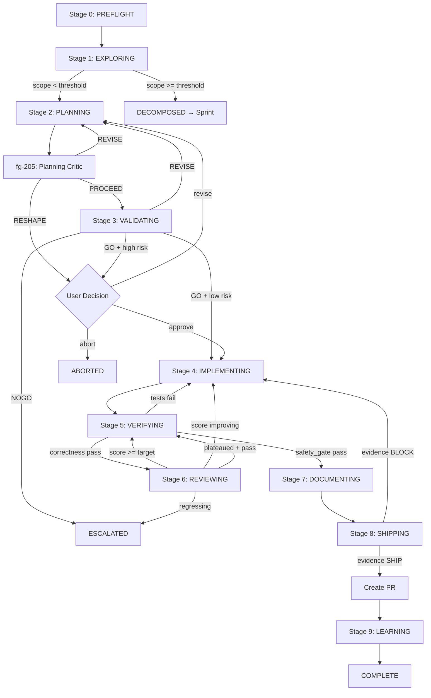
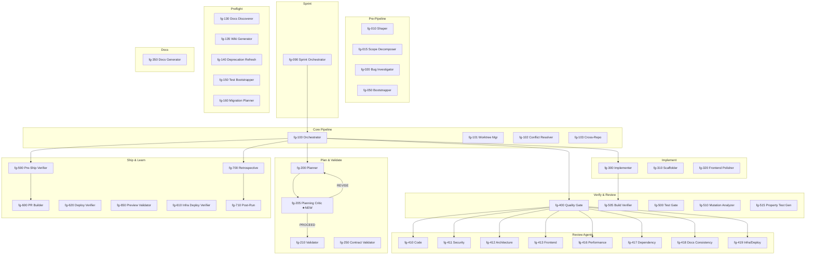
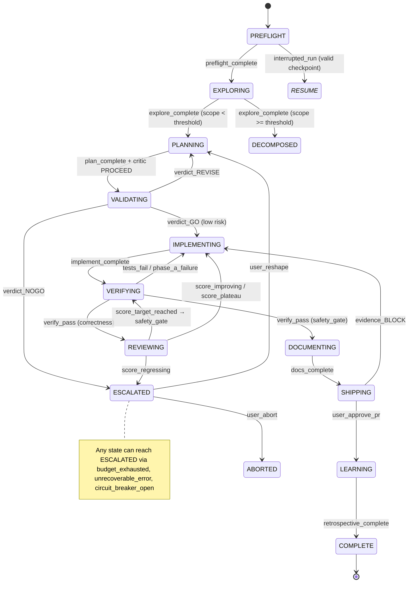

# Phase 6: Documentation & Skills Polish

**Status:** Approved  
**Date:** 2026-04-15  
**Depends on:** Phase 5 (new agent registered, new features documented)  
**Unlocks:** Nothing (final phase)

## Problem

1. **CLAUDE.md organization:** At 387 lines, it's within target but contains sections that belong in referenced docs (PREFLIGHT constraints, framework gotchas). Moving these reduces per-conversation token cost.

2. **Missing `ui:` frontmatter:** 10 skills use `AskUserQuestion`, `TaskCreate`, or `EnterPlanMode` but don't declare `ui:` capabilities in their frontmatter, violating the convention documented in CLAUDE.md.

3. **Caveman description contradiction:** Line 3 says "40-70%" but line 74 says "4-10% realistic" — different metrics (prose-only vs session-total) that confuse users.

4. **Redundant routing guide:** `shared/skill-routing-guide.md` (67 lines) duplicates a subset of `/forge-help` (134 lines). Two sources of truth for skill routing.

5. **No architecture diagrams:** Complex 41-agent system with 10-stage pipeline has no visual documentation.

## Solution

### 1. Reorganize CLAUDE.md

**Extract to `shared/preflight-constraints.md`:**
Move the "PREFLIGHT constraints" subsection from the "Gotchas" section. This is ~80 lines of validation rules that agents reference at PREFLIGHT but don't need in every conversation context.

Replace in CLAUDE.md with:
```markdown
### PREFLIGHT constraints

See `shared/preflight-constraints.md` for all PREFLIGHT validation rules (scoring thresholds, convergence limits, sprint config, shipping gates, model routing, implementer inner loop, confidence, output compression, AI quality, build graph, cost alerting, eval, context guard, compression eval).
```

**Extract to `shared/framework-gotchas.md`:**
Move the "Framework gotchas" subsection. Each framework has its own `conventions.md` — cross-cutting notes belong in a dedicated file, not the main system prompt.

Replace in CLAUDE.md with:
```markdown
### Framework gotchas

See `shared/framework-gotchas.md` for non-obvious conventions per framework. Each framework's full conventions are in `modules/frameworks/{name}/conventions.md`.
```

**Update references:**
- Add `shared/preflight-constraints.md` and `shared/framework-gotchas.md` to the "Key entry points" table
- Add fg-205-planning-critic to the Agents section
- Update agent count from 41 to 42
- Add cross-project learnings to the v2.0 features table
- Update version references from 2.6.1 to 2.7.0 (all 6 phases ship as one release)

**Target:** ~320-330 lines (from current 387). Exact extraction lines will be identified during implementation via grep for the section headers.

### 2. Add `ui:` frontmatter to 10 skills

For each skill, add the appropriate `ui:` declaration based on which UI tools they use:

| Skill | Uses | `ui:` Value |
|-------|------|-------------|
| `forge-init` | AskUserQuestion | `ui: { ask: true }` |
| `forge-deploy` | AskUserQuestion | `ui: { ask: true }` |
| `forge-resume` | AskUserQuestion | `ui: { ask: true }` |
| `forge-config` | AskUserQuestion | `ui: { ask: true }` |
| `forge-sprint` | AskUserQuestion, TaskCreate | `ui: { ask: true, tasks: true }` |
| `forge-repair-state` | AskUserQuestion | `ui: { ask: true }` |
| `forge-shape` | AskUserQuestion, EnterPlanMode | `ui: { ask: true, plan: true }` |
| `forge-abort` | AskUserQuestion | `ui: { ask: true }` |
| `forge-reset` | AskUserQuestion | `ui: { ask: true }` |
| `forge-automation` | AskUserQuestion | `ui: { ask: true }` |

Format: add `ui:` line to YAML frontmatter block after `allowed-tools:`. The `ui:` field uses the same YAML format as the rest of the frontmatter. Valid keys: `ask` (AskUserQuestion), `tasks` (TaskCreate/TaskUpdate), `plan` (EnterPlanMode/ExitPlanMode). All values are boolean. Skill files live at `skills/{name}/SKILL.md`.

### 3. Fix caveman description

**File:** `skills/forge-caveman/SKILL.md` line 3

**Before:**
```yaml
description: "Toggle caveman-style terse output for Forge pipeline messages. Use when you want to reduce user-facing output tokens by 40-70% while preserving technical substance. Trigger: /forge-caveman [mode], caveman mode, less tokens, be brief"
```

**After:**
```yaml
description: "Toggle terse output for Forge pipeline messages. Reduces prose by 40-70% per message (4-10% total session token savings). Use when you want briefer output. Trigger: /forge-caveman [mode], caveman mode, less tokens, be brief"
```

Also update the step 4 confirmation messages (lines 50-52) to include the session-total context:
```markdown
- `lite`: "Caveman lite active. Drop filler, keep grammar. (~20% prose reduction, ~2-4% session savings)"
- `full`: "Caveman on. [thing] [action] [reason]. [next step]. (~45% prose reduction, ~4-7% session savings)"  
- `ultra`: "CAVEMAN ULTRA. Max compress. Abbrev all. (~65% prose reduction, ~7-10% session savings)"
```

### 4. Delete `shared/skill-routing-guide.md`

- Delete the file
- Remove any references to it from:
  - CLAUDE.md (check "Key entry points" table and any inline references)
  - Agent docs that reference it
  - Skill docs that reference it
- `/forge-help` becomes the single authoritative routing reference

### 5. Add architecture diagrams

Create `docs/architecture/` directory with 3 Mermaid diagram files:

#### `docs/architecture/pipeline-flow.md`

```markdown
# Pipeline Flow

10-stage pipeline with decision points and feedback loops.


```

#### `docs/architecture/agent-dispatch.md`

Agent hierarchy showing orchestrator at center, dispatch relationships, and agent tiers.

```markdown
# Agent Dispatch Graph


```

#### `docs/architecture/state-machine.md`

State transition diagram showing all states and key transitions.

```markdown
# State Machine


```

### 6. Update README.md

- Add "Architecture" section with links to diagram files
- Update version to 2.7.0
- Mention planning critic agent in agent list
- Mention cross-project learnings as new feature

### 7. Update CLAUDE.md with all phase changes

After all phases are implemented, CLAUDE.md needs these updates:
- Version: 2.6.1 → 2.7.0
- Agent count: 41 → 42
- Add fg-205-planning-critic to agent list and dispatch flow
- Add `shared/preflight-constraints.md` and `shared/framework-gotchas.md` to key entry points
- Add cross-project learnings to v2.0 features table
- Remove skill-routing-guide.md reference
- State schema version: 1.5.0 → 1.6.0
- Add `critic_revisions`, `flapping_count`, `locked` to state schema description

## Files Changed

| File | Action |
|------|--------|
| `CLAUDE.md` | **Modify** — reorganize, extract sections, update references |
| `shared/preflight-constraints.md` | **Create** — extracted from CLAUDE.md |
| `shared/framework-gotchas.md` | **Create** — extracted from CLAUDE.md |
| `skills/forge-caveman/SKILL.md` | **Modify** — fix description and confirmation messages |
| 10 skill `SKILL.md` files | **Modify** — add `ui:` frontmatter |
| `shared/skill-routing-guide.md` | **Delete** |
| `docs/architecture/pipeline-flow.md` | **Create** |
| `docs/architecture/agent-dispatch.md` | **Create** |
| `docs/architecture/state-machine.md` | **Create** |
| `README.md` | **Modify** — add architecture links, update version |

## Testing

- `tests/structural/skill-descriptions.bats` must pass with updated descriptions
- `tests/structural/skill-naming.bats` must pass
- `validate-plugin.sh` must pass (checks agent frontmatter, skill structure)
- New test:
  - `tests/structural/ui-frontmatter-consistency.bats`: Verify skills using AskUserQuestion/TaskCreate/EnterPlanMode have `ui:` declared
  - `tests/structural/architecture-diagrams.bats`: Verify diagram files exist and contain valid Mermaid syntax markers
  - `tests/structural/cross-references.bats` update: Verify no references to deleted `skill-routing-guide.md`

## Risks

- **CLAUDE.md line reduction may break agent expectations:** Agents that reference PREFLIGHT constraints inline may not find them after extraction. Mitigation: agents should reference `shared/preflight-constraints.md` directly (or the orchestrator loads it at PREFLIGHT).
- **Mermaid rendering:** Diagrams render in GitHub, VS Code, and most markdown viewers. No runtime dependency.

## Success Criteria

1. CLAUDE.md is ~320-330 lines (down from 387)
2. All 10 skills have `ui:` frontmatter matching their actual tool usage
3. Caveman description accurately reflects both prose and session savings
4. `skill-routing-guide.md` is deleted; no dangling references
5. 3 architecture diagrams exist with valid Mermaid syntax
6. README.md is updated with architecture links and version
7. All structural tests pass
