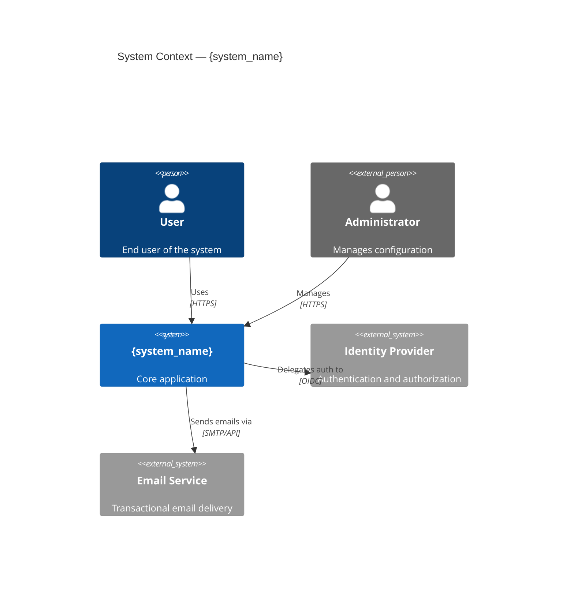
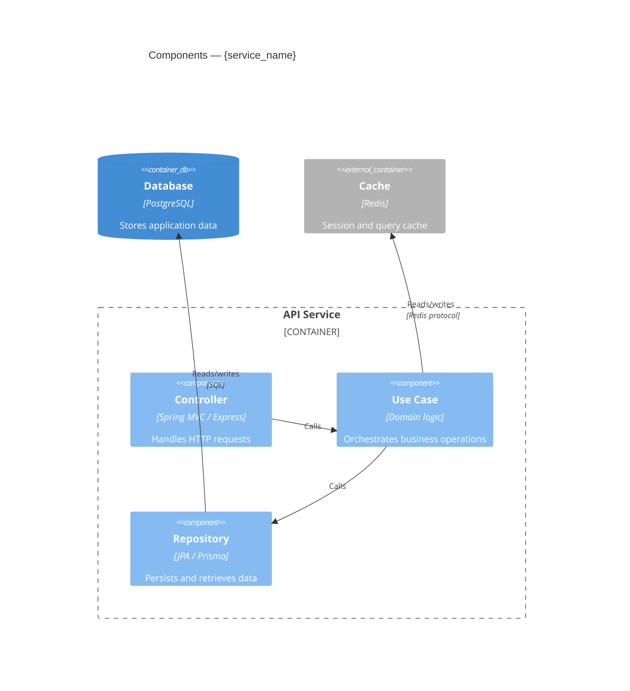
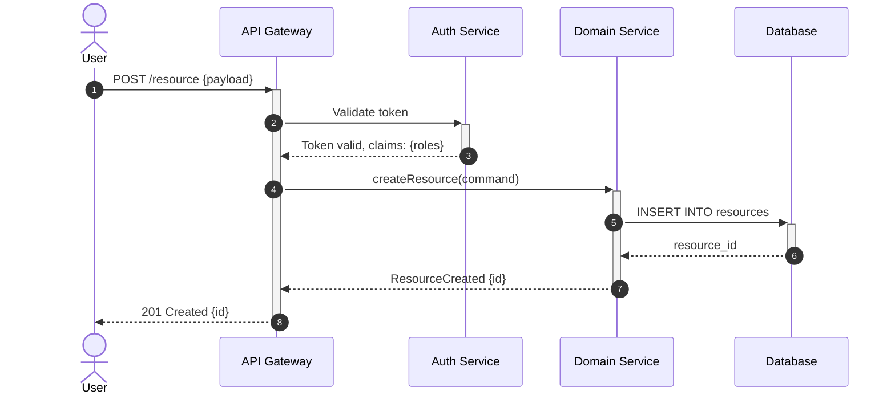
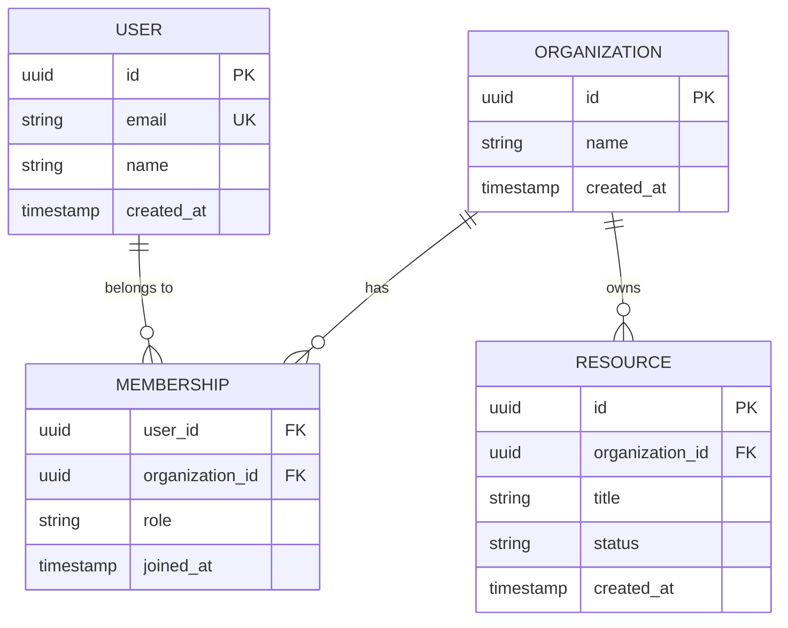
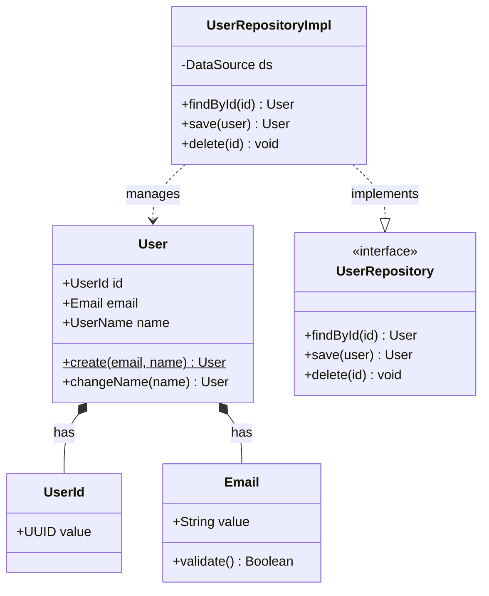
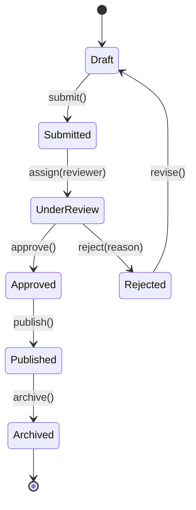

# Diagram Patterns

Mermaid and PlantUML patterns for common diagram types. Mermaid is the default — it renders natively in GitHub and GitLab without additional tooling.

## C4 Context Diagram

Shows the system and its relationships with external actors and systems.



## C4 Component Diagram

Shows the internal structure of a container (application or service).



## Sequence Diagram

Shows interactions between components over time.



## ER Diagram

Shows data entities and their relationships.



## Class Diagram

Shows class structures and relationships in the domain model.



## State Diagram

Shows state transitions for an entity or process.



## PlantUML Alternative

Use PlantUML when Mermaid cannot express the required diagram type (e.g., deployment diagrams, advanced sequence features). Requires PlantUML server or local render step.

```plantuml
@startuml
!include https://raw.githubusercontent.com/plantuml-stdlib/C4-PlantUML/master/C4_Context.puml

Person(user, "User", "End user")
System(system, "{system_name}", "Core application")
Rel(user, system, "Uses", "HTTPS")

@enduml
```

## Dos and Don'ts

**Dos:**
- Use Mermaid for GitHub/GitLab — no render step required
- Keep diagrams focused — one concept per diagram
- Use `autonumber` in sequence diagrams with 5+ steps
- Title every C4 diagram (`title ...`)

**Don'ts:**
- Don't put more than 10 nodes in a single diagram — split it
- Don't use PlantUML for diagrams Mermaid handles equally well
- Don't embed diagrams in code comments — reference the doc file instead
