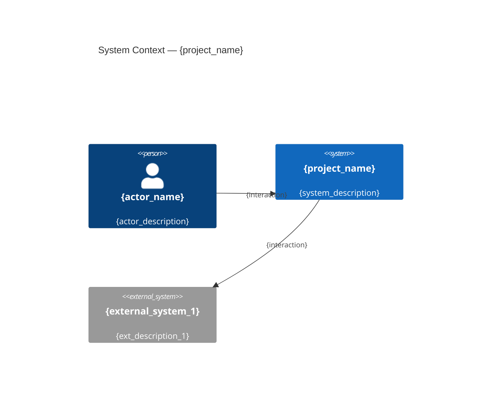
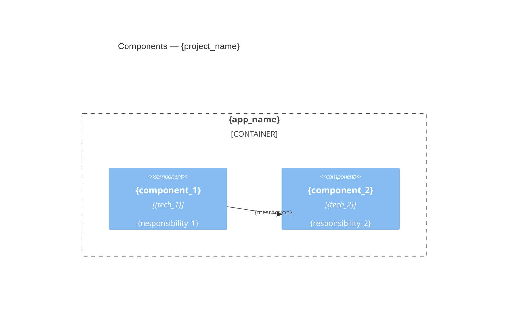
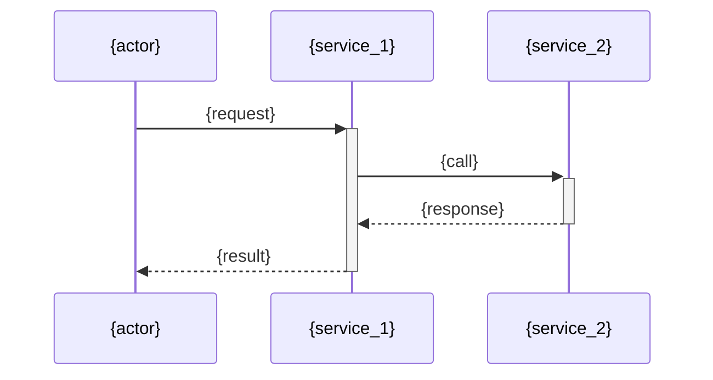

# Architecture: {project_name}

{one_paragraph_summary — what the system does and why it is structured this way}

## System Context

## Component Overview

## Layers

| Layer | Responsibility | Key types |
|-------|---------------|-----------|
| {layer_1} | {responsibility_1} | {types_1} |
| {layer_2} | {responsibility_2} | {types_2} |

## Data Flow

{description of primary data flow through the system}

## Key Design Decisions

See [docs/adr/](docs/adr/) for individual ADRs.

| Decision | ADR | Summary |
|----------|-----|---------|
| {decision_1} | [ADR-{nnn}](docs/adr/adr-{nnn}-{slug}.md) | {one_line_summary} |

## Dependencies

{description of external dependencies and why each is included}

<!-- user-maintained -->

<!-- /user-maintained -->

<!-- generated by dev-pipeline docs-generator -->
<!-- Last updated: {date} -->
